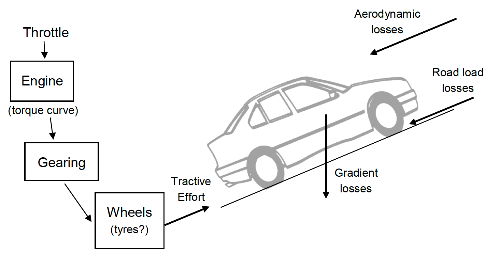
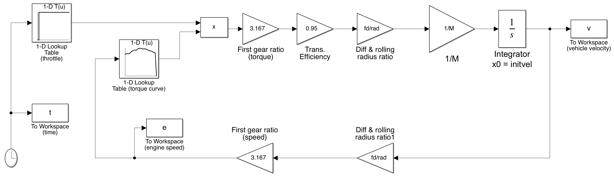
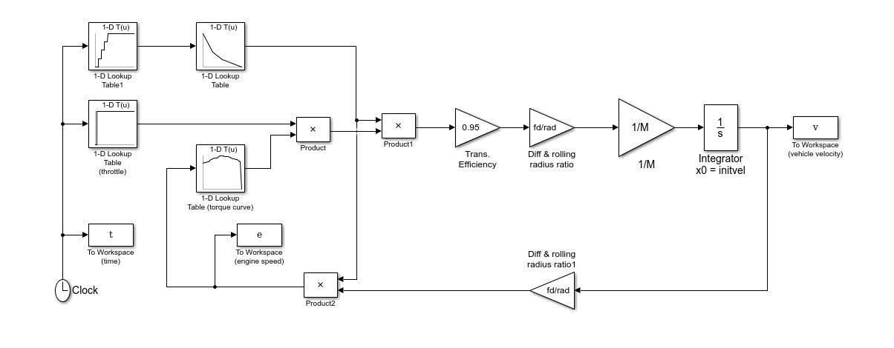
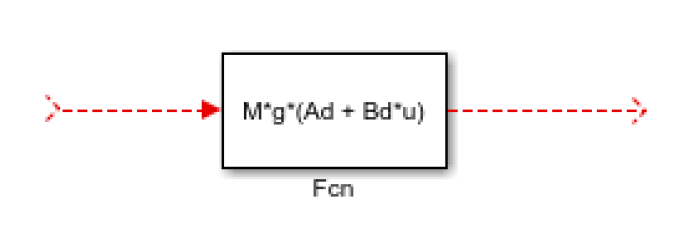
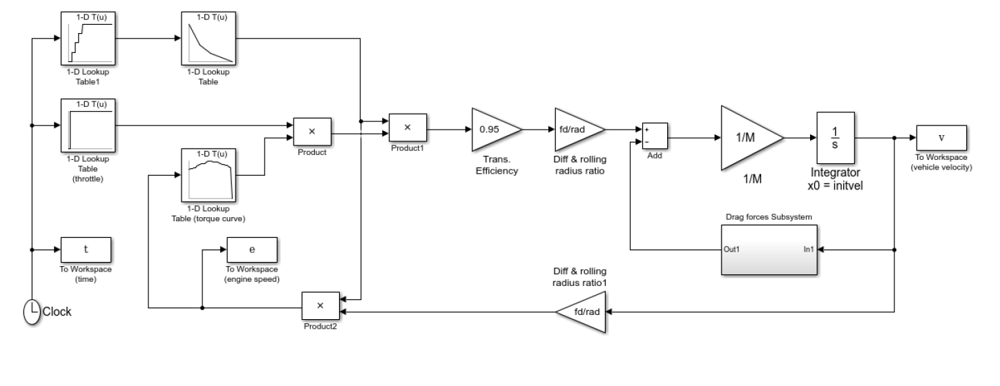
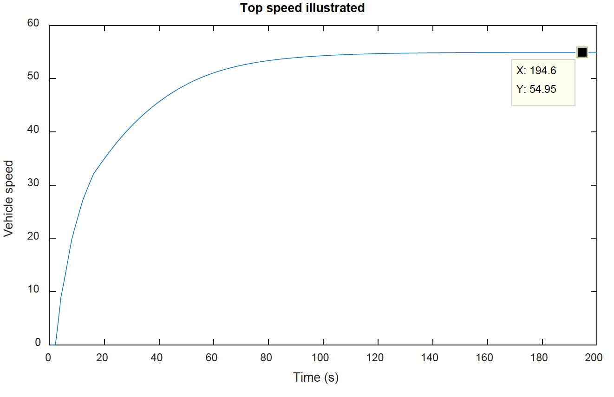
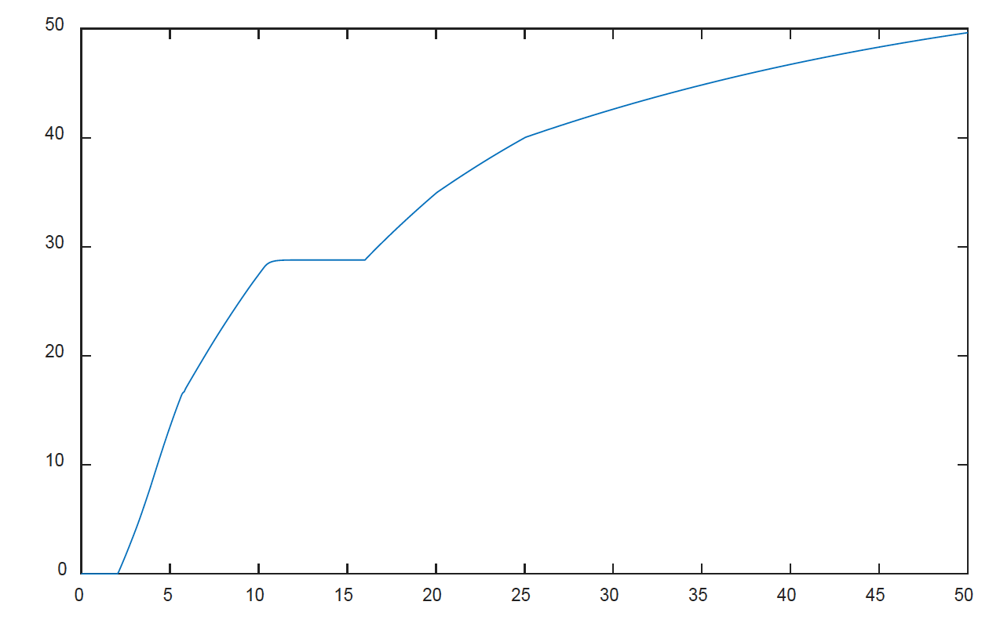
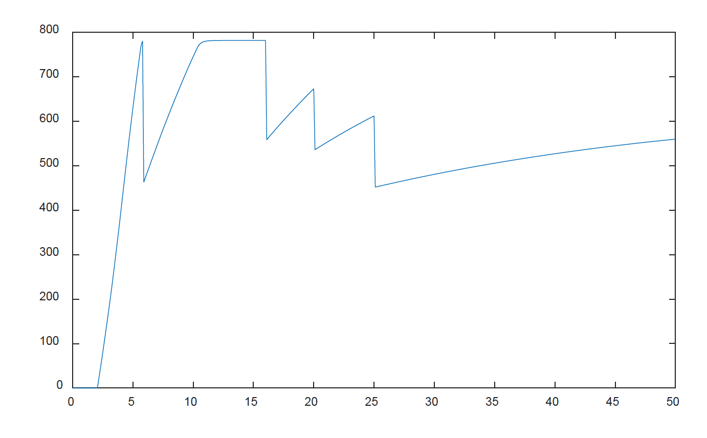
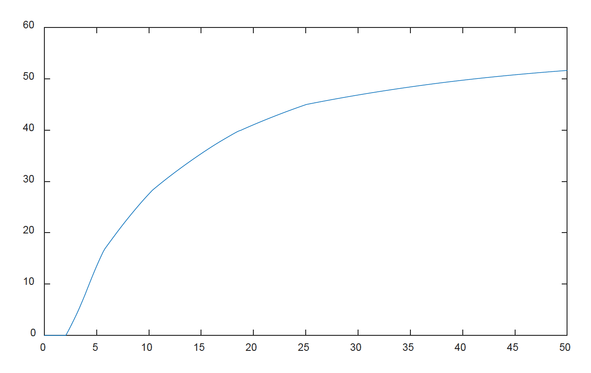
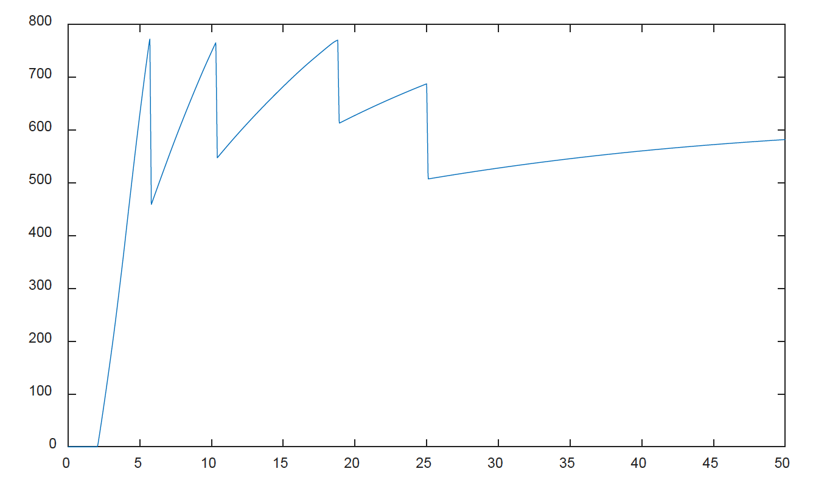

# Drivetrain Modelling I



In this lab we will develop a simple driveline model from a template which simulates vehicle speed assuming fixed gear with no losses. The final version of the model will include gear changes and road, aerodynamic and gradient losses.

The equation of motion we need here is simply $F=Ma$. There is only one state, velocity, and its differential equation with respect to time is;

$$ \dot{v}=\frac{\sum F}{M} \nonumber $$

## Step 1

Download the simple drivetrain model, [drive.slx](files/drivetrain_lab/drive.slx), along with the initialisation file [initdrive.m](files/drivetrain_lab/Initdrive.m). Now start MATLAB, set the working directory to the folder you downloaded the files into and start Simulink.

Open the model by double clicking the model file or right click and select Open. Now run the initilisation file.

<details close markdown="block">
  <summary style="color:green;">
    VIEW SCREEN CAPTURE
  </summary>
<hr>


<hr>
</details>

Notice (Figure 1 below and the block diagram) is formed around the integrator block. The model works, starting from an initial condition (*initvel*, set in the integrator) by computing values around the network of lines and blocks.

Following the line out of the integrator, vehicle velocity is multiplied by $fd/rad$ and then the gear ratio to find engine speed. This then determines the WOT engine torque (from a lookup table of the torque map) which is multiplied by the current throttle opening (which we will set between 0 and 1 and we use another lookup table to define the input, as a function of time). The resulting effective engine torque is multiplied by gear ratio, efficiency and $fd/rad$ and the line out of *Diff & rolling radius ratio* represents tractive effort which is the total drive force acting at the tyre contact patches. Dividing by $M$ then gives acceleration which is what the integrator needs to know in order for the model to progress forward in timeS. The simulation as a whole works by repeatedly re-calculating the input to the integrator block, while discretely increasing the simulation time to build up a time domain record of the variables we want to store as outputs. Here the output variables $t$, $v$ and $e$ are stored using *To Workspace* blocks.

\\
Figure 1: Block diagram of *drive.slx* model

Run the model by clicking the *play* button (forward triangle) on the model window. Note that, after the simulation has run, you now have new variables in the MATLAB workspace, $t$, $v$ and $e$ arrays have been created by the model. They are long column vectors with each row representing the given variable at an instance in time, stepping from 0 to the final time, 50 seconds which is set in the simulation menu panel.

<details close markdown="block">
  <summary style="color:green;">
    VIEW SCREEN CAPTURE
  </summary>
<hr>


<hr>
</details>

Plot the engine speed against time.  Why does the speed saturate at 785.4? Plot the torque curve in a separate figure window (the command `help figure` may be useful). The omega and torq variables for the torque curve are generated by *initdrive.m*. To understand what’s going on, it may be helpful to consider that the default operation when Simulink interpolates a lookup table where the input is out of bounds is to extrapolate from the values it does have.

If this is all still confusing, try commenting out (putting a % before) the last line of data in the torque_curve in *initdrive.m*. Then rerun *initdrive.m*, rerun the simulation and replot the engine speed. The top speed in this gear increases because the torque curve is being extrapolated when the vehicle speed pulls the engine speed out of range. Also consider what must be happening at the start of the simulation, when $v=0$ (but the torque curve isn’t defined at e=0).

Take a minute to look at the simulation parameters (select Simulation -> Model Configuration Parameters from the menu at the top of the model window). This is where the simulation run-time is also shown, along with the method of integration.

## Step 2

Now let’s look at improving the simulation. To allow gear changes, you’ll need to replace the two simple gain blocks (3.167) with product (multiplication) blocks and add further blocks to the model to allow the gear to change as a function of time.

<details close markdown="block">
  <summary style="color:green;">
    VIEW SCREEN CAPTURE
  </summary>
<hr>


<hr>
</details>

Change your model so it looks like the one below (Figure 2) you’ll need to find the product and the (simple) *1-D Lookup Table* block in the Simulink library and drag and drop them onto your model.

You’ll need to put the gear variable (set up by *initdrive.m*) into the left hand lookup table (see how this is done by looking at the Throttle block which is already in the model). In the right hand (new) lookup table, the *Table data* should be the variable *gr*. The *vector of input values* should be set as [1, 2, 3, 4, 5]. These two lookup tables together will then convert time to gear number and then gear number to gear ratio. When this stage is complete your model should look like this;

\\
Figure 2: Reconfigured model

Why did we use two lookup tables to map from time to gear ratio? Because we’re using lookup tables for different tasks here. The far left blocks generate inputs to the model, set using throttle and gear variables in *initdrive.m*. We can change these to vary the timing of acceleration and gear change events in the simulation, to run various, 'what if', scenarios. The other new lookup table you introduced contains model parameters which would only change if we wanted to simulate a different vehicle.

Now run the revised model and plot vehicle and engine speeds against time. Note how the gear changes give realistic changes in the engine speed and how the vehicle acceleration changes with each gear change.

## Step 3

Now think about losses. The model needs to include drag forces representing aerodynamic losses, road load and any road inclination. Start by putting a *Sum* block (from the Simulink -> Math Operations library) into your model, between the Diff & rolling radius gain and the $1/M$ gain. According to the $F = Ma$ equation this is the point at which forces are applied to the vehicle (the force is then divided by $M$ to give acceleration and then integrated to give velocity). Keeping things simple, the equations for the drag forces are;

$$ \begin{aligned}
&F_{\text {road }}=M g\left(A_{d}+B_{d} v\right) \\
&F_{\text {aero }}=0.5 \rho A C_{d} v^{2} \\
&F_{\text {incline }}=M g \sin (\beta) \end{aligned} \nonumber $$

Use the Function (*Fcn* in the User Defined Functions sub-library) block repeated as necessary to incorporate these losses into your model (you’ll also need a constant block, to feed in inclination angle as set up (in degrees) in *initdrive.m*. This needs to be in radians when it gets to the *sin* function make the change within the constant block, or use a gain block.

The use of variable names is interesting here. In the drag term equations above, velocity is referred to as $v$. To be fair, the Simulink model also has a connecting line, which we have linked to the variable *v* using a *To Workspace* block. But, this does not mean Simulink now knows what *v* is. When using your Fcn block you will need to wire it to your diagram and refer to the input as *u* in the MATLAB code you type in as the function. Double click on the *Fcn* block and read the instructions. For example, the *Froad* block must be configured like this, where the incoming dashed red line will need to be connected to the line on the original model which carries what we know to be *v*. The outgoing dashed red line will then be *Froad* and needs to be applied (wired) to the diagram to give a drag force, opposing the drive force already present.



Finally, see how Simulink allows you to create hierarchical structures within models. Group together all the loss force blocks (without the *Sum* block) by selecting them all and choosing Diagram -> Subsystem and Model Reference -> Create Subsytem from Selection. Double click the resulting subsystem block to see what’s underneath. Call it something sensible and note that if you change the names of the *inports* and *outports* within a subsystem that name also changes on the block at the level above.

Hopefully your completed model looks like this (leaving you to work out what it should look like inside the subsystem!):



Figure 3: Completed model

## Step 4

Now try running the model. How do the vehicle and engine speeds vary over time? Is this sensible?

What if the throttle is not kept open? Modify the *initdrive.m* file so that the throttle drops down to zero after 3 seconds, by setting it to `throttle = [0 2 2.1 3 3.1 50; 0 0 1 1 0 0];`

The setting of this variable can seem quite confusing though it looks more sensible when you see the time history of throttle input;

```matlab
>> plot(throttle(1,:),throttle(2,:))
```

Remember the time values (first row) correspond to throttle opening (second row) and the lookup table will interpolate between each point. To approximate a step input we have to put in extra points at 2.1 and 3.1 seconds. Try plotting the throttle input without these points to see why. Note also that we can’t set two values at $t=2$ to get a perfect step because the lookup table insists all the values in the breakpoints vector are monotonically increasing.

You’ll need to save *initdrive.m* and rerun the simulation before it takes effect in the model. Rerun the simulation and look at vehicle and engine speeds again. What’s wrong and why? Look at the points where engine (and vehicle) speed become negative. Are these correct (for a flat road?) What causes the modelled vehicle to start reversing from $t=0$?

There are complicated ways to make the simulation more accurate but a simple solution to the problem is to fix the integrator so the model only simulated positive speeds. Double click the integrator to see how.

What about engine idle, how does the model deal with this condition? Is it physically correct and if not, how could it be adapted to be more accurate. This might be easy or might necessitate significant additional work on the model.

## Step 5

Use your finalised model to get simulated answers to performance and time to speed tests for this vehicle as below. The answers are provided but please do try this for yourself.

### What is the top speed of the vehicle?

<details close markdown="block">
  <summary>
    See solution
  </summary>

You will need to extend the simulation end time to beyond 50 seconds.

As the original inputs already change up to top gear and use throttle = 1 (WOT) it is only necessary to extend the simulation time to eventually reach top speed which is about 54.95m/s (about 124 mph).



</details>

### What is the fastest 0-60mph time you can simulate?

<details close markdown="block">
  <summary>
    See solution
  </summary>

You will need to optimise the gear change timings. You can do this manually by modifying the gear variable also note that the model uses SI units so the recorded velocity is in m/s.

This is trickier as the gear change timing needs to be optimised, by trial and error. What we are trying to achieve is maximum use of first gear (where the torque is always higher than second gear but not holding first gear for too long as the vehicle can’t get to 60mph in first gear. Here is some code, progressively changing gct12. Try higher and lower values, and you’ll see in both cases the time to achieve 26.67m/s is longer.

```matlab
Initdrive
gct12 = 5.8
gear = [0 gct12 gct12+0.1 16 16.1 20.0 20.1 25 25.1 50
        1 1     2         2   3   3     4   4  5    5];
sim('drive_final');
figure(1), clf
plot(t,v)
figure(2), clf
plot(t,e)
ind = sum(v<26.67);
t(ind)>)
```

The optimised plots are shown below. Note that the best time (to within 0.1s) is 9.545s but in the simulation we didn’t set the throttle to WOT until 2 seconds so the fastest 0-60mph time is 7.55 seconds.





</details>

### What is the fastest 0-100mph time?

<details close markdown="block">
  <summary>
    See solution
  </summary>

It should be pretty obvious that this just extends the previous exercise. Now we need to optimise the first three gear change timings. Interestingly you have to do a bit of repeated tuning to get this exactly right. I found the following were the best gear-change times (again to within 0.1 second each).

```matlab
gct = 5.7;
gct23 = 10.3;
gct = 18.8;
```

This gives a recorded time of 24.22 seconds, so a result (given the start at t=2) for 0-44.44m/s, of 22.22 seconds. Again the $v$ and $e$ plots are given below, note how the engine speed just spikes at its peak point in all of the first three gears.





</details>
