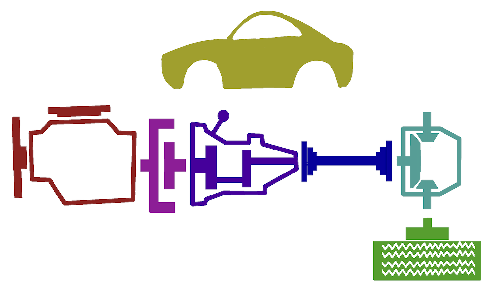
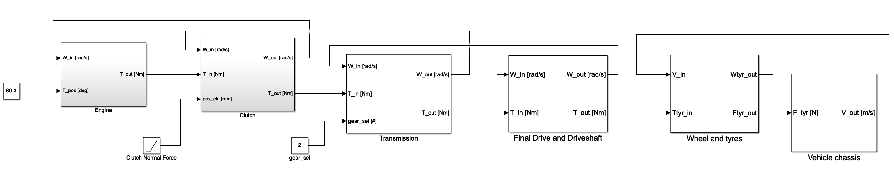
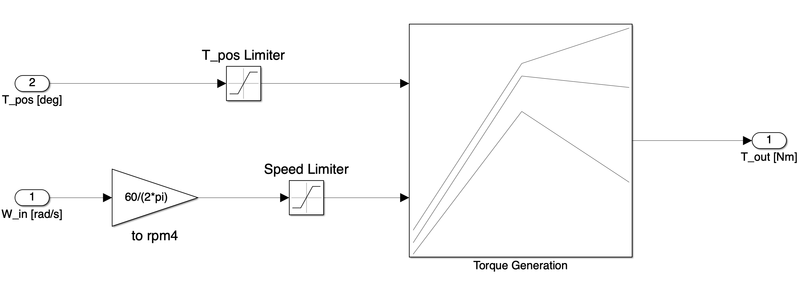
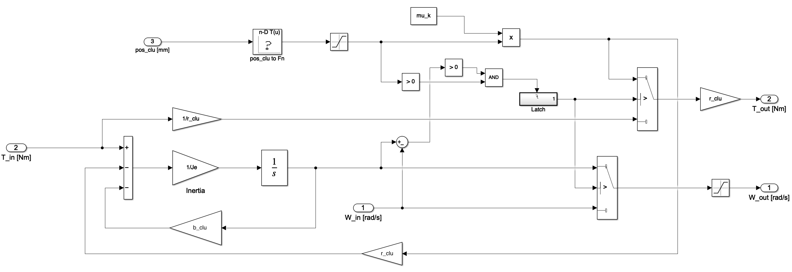
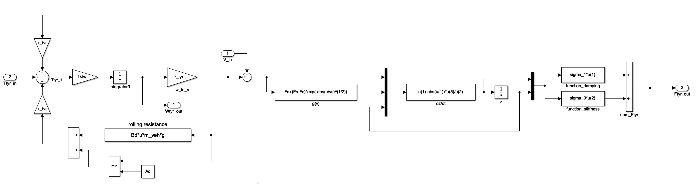
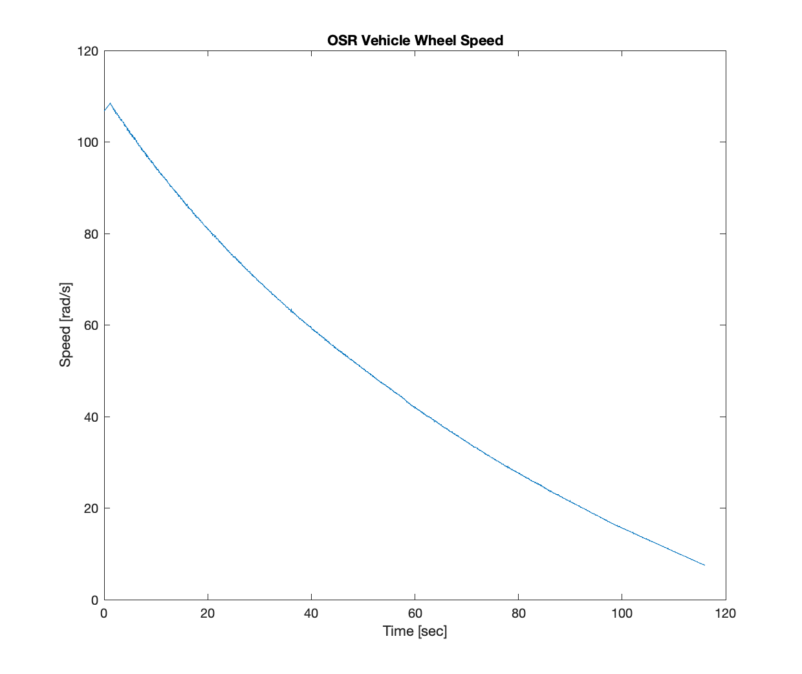
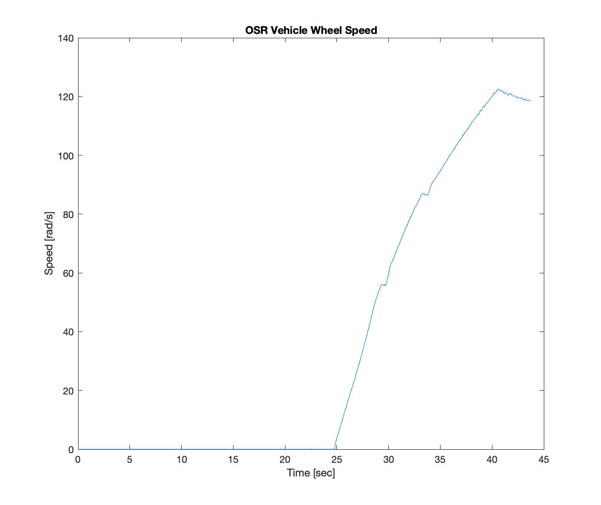

# Drivetrain Modelling II

In this laboratory you will be creating a drivetrain model that will be used for straight line performance evaluation during MIRA week. The drivetrain model is generic in that it can be parameterised for a number of different vehicles. The parameters that you are provided with in this case are for a Ford Focus 2.0l Ecoboost.

\
*Schematic in overview of the vehicle drivetrain*

This exercise will give you an opportunity to create your own drivetrain model based upon the suggested structure. By building the model from physics-based first principles you will gain greater understanding of:

- Each subsystem's function within the drivetrain.
- Its representation within the model.

and perhaps most importantly:

- The parameters that influence its operation.

## Approach to Model Development

Download the drivetrain model template, [DrivetrainTemplate.mdl]({{ site.url }}/ttc066-module/labs/files/drivetrain_lab_2/DrivetrainTemplate_r2019b.slx.zip) and open it in Simulink.  Also download the model parameters file [DrivetrainParameters.m]({{ site.url }}/ttc066-module/labs/files/drivetrain_lab_2/DrivetrainParameters.m) and open these in the editor.

\
*Top level of the drivetrain model template, DrivetrainTemplate.mdl*

Look at the inputs and outputs of each of the main top-level blocks within the Simulink model, this defines the information available in each of the subsystems;

- Engine
- Clutch
- Transmission
- Driveshaft
- Final Drive
- Wheels and Tyres
- Vehicle Chassis.

Note the units required for each of these inputs and outputs.

Now look at the model parameters in *DrivetrainParameters.m*, which represent the information that is known about the drivetrain. Each of these also has a description of the units of the data. The model is to be constructed in a modular format such that the various subsystems can be swapped and changed if required in the future.

### Engine

This subsystem is prebuilt, note the inputs and outputs.

The submodel is a 2D lookup table with inputs speed [rpm] and throttle position [θ].The output is brake torque. This kind of lookup table represents the simplist of engine models and was populated using data obtained on a dynamometer.  

### Clutch

This subsystem is prebuilt. Note the inputs and outputs, and most importantly note the logic employed.

Initially the clutch is in the slipping condition with normal force equal to $0$.  Upon application of some normal force $F_n$, the transmitted torque $T$ becomes:

$$T = μ_{k}F_{n} \nonumber $$

This accelerates the driven shaft which speeds up. When the angular velocities of the input and output shafts are equal the clutch is judged to be locked and the transmitted torque is equal to the input torque.  Once locked the clutch is latched in this state i.e. it will not unlock again.

In the slipping condition the angular velocity of the input shaft (and hence engine speed) is calculated locally.  In the locked condition the angular velocity of the input and hence output shaft is calculated further downstream (i.e. at the transmission and beyond) and fed back to this subsystem.  This is the way in which the degrees of freedom of the system are effectively coupled on transition from slipping to locked states.

### Transmission

Open the transmission model, noting the inputs and outputs and the units required for each.

The output torque is calculated by multiplying the input torque by the gear ratio, this is then fed downstream to the Final Drive and Driveshaft. Using five 2D lookup tables the friction torque (a function of speed and torque) should be subtracted from the output torque.  The data for the friction torque is available in the parameter file.

The output angular velocity is fed back to the clutch and therefore represents the clutch speed.  Since the input to the transmission and the output from the clutch are the same, the input velocity to the transmission should be set equal to the output velocity of the clutch.

### Final Drive and Driveshaft

Open the Final Drive and Driveshaft submodel, again note the inputs and outputs which are the same in name as the previous two subsystems. This is one of the two subsystems in this model that includes compliance and damping (the Wheel and Tyres Subsystem is the other one).

The relationship between the wheel speed (an input to the subsystem) and the speed at the input of the final drive (an output of the subsystem) is simply given by the final drive ratio $r_{fd}$.

The trickiest output of this sub-system to compute is $T_{out}$, which is the torque at the input of the wheels and tyres sub-system. The input $T_{in}$ is the torque at the input of the final drive. Intuitively, the output torque at the wheels is:

$$ T_{out} = T_{in}r_{fd} \nonumber $$

However, this ignores the fact that the driveshaft connection between the final drive output and the wheel is a compliant connection and not a rigid one (see drivetrain illustration in [Drivetrain Modelling]({{ site.url }}/ttc066-module/lectures/Drivetrain%20Modelling%20II.pdf) slide pack). To obtain the actual torque output to the wheel you will need to reproduce the dampening and compliance equation:

$$ T_{out} = k(\theta_{fd} - \theta_{wh}) + b(\dot{\theta_{fd}} - \dot{\theta_{wh}}) \nonumber $$

Where $k$ is the shaft stiffness, $b$ the shaft damping term, $\theta_{fd}$ and $\dot{\theta_{fd}}$ are the angular position and velocity out of the final drive. $\theta_{wh}$ and $\dot{\theta_{wh}}$ are the angular position and velocity of the wheel. $\dot{\theta_{wh}}$ is a known quantity, as it is an input to the subsystem.

$\dot{\theta_{fd}}$, however, is a quantity that needs to be calculated within your model. To do this you will need to recall Newton's Second Law for rotation and apply it to the final drive:

$$ T_{in}r_{fd} - T_{out} = J_{tot}\ddot{\theta_{fd}} \nonumber $$

To use this equation, you will need to compute the inertia term $J_{tot}$, given by the following equation:

$$ J_{tot} = [J_{f} \left(\frac{r_2}{r_1}\right)^2 + J_g]r_{fd}^2 + J_{fd} \nonumber $$

Where $J_f$ is the referred inertia of the engine and flywheel, $\frac{r_2}{r_1}$ is the currently selected gear ratio, $J_g$ is the inertia of the currently selected gear, $r_{fd}$ the final drive ratio and $J_{fd}$ is final drive inertia.

To compute the above equation you will need to use a 1-D lookup table to obtain $J_g$, with an array of gear numbers as breakpoints and the array of $J_g$ values given in the parameter file as outputs.

After all of this you will be able to compute $\ddot{\theta_{fd}}$ from the Newton's Second Law equation. It should then be clear what you need to do to compute $T_{out}$ from the compliance equation and complete your model.

Finally, make sure that you set the initial conditions of any integrators you use, including the angular position and velocity of the final drive and the position of the wheel.

### Tyre Model

Open the tyre model which has already been created. The subsystem is based on the LuGre model and also includes the effect of tyre rolling resistance.

Note the three terms that are used to calculate the total force generated in the contact patch.  It is the sum of;

- a viscous term  (the force generated through the lubricant layer between the road and tyre).
- a damping and stiffness term (a consequence of the deflection of any number of ‘bristles’ that describe the asperity contact points between the tyre and road).

The constant $\sigma_0$ is the constant associated with the stiffness, $\sigma_1$ is associated with the damping and $\sigma_2$ the viscosity.  The rolling resistance is modelled;

$$ F_{rr} = (A_d + B_{d}V)m_{veh}g  \nonumber $$

With the constants $A_d$ and $B_d$ adjusting the rolling resistance.  Note that the constant $A_d$ is effectively scaled with speed up to a maximum value equal to $A_d$ (not indicated in the equation above) to ensure that the model doesn’t apply rolling resistance at $V=0$.

### Chassis Model

Finally open the chassis model, noting the inputs and outputs. Complete the model to include the effects of aerodynamic drag (gravitational force is not required since the time to speed tests will be undertaken on a level road).

## Obtaining Results

In the simulation configuration parameters change the solver to ode5 (Dormand-Prince) fixed step solver with a step size of no greater than $0.0001$ seconds (note that such a small step is required because this is a stiff system).

Undertake a coastdown simulation by setting the clutch normal force to $0 N$ and entering some suitable initial conditions for each of the subsystems (the ones entered in the parameter file should be fine).

Also complete a time to speed simulation by setting some suitable initial conditions, allowing the simulation to run for a number of seconds and then with throttle wide open applying clutch normal force with a suitable high ramp rate.

### Analysis and Plotting

Plot the results obtained on two different graphs, from $t=0$ to $t=116$ seconds.

Using the measurement [Coast-data.mat]({{ site.url }}/ttc066-module/labs/files/drivetrain_lab_2/Coast-data.mat) and [Accel-data.mat]({{ site.url }}/ttc066-module/labs/files/drivetrain_lab_2/Accel-data.mat) plot the speed measurements (choose one of the front wheel speeds) alongside the simulation results to show how they differ.  Think about which parameters you would change to get closer correspondence between the two curves.

For reference, the test data in the *CoastdownData.mat* and *SpeedData.mat* files are shown below.

\
*Figure: Coastdown data plot showing deceleration of vehicle OSR wheel*

\
*Figure: Acceleration data plot showing deceleration of vehicle OSR wheel*

