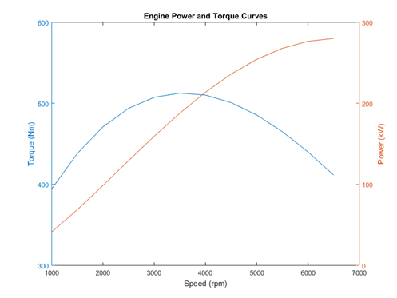

# Engine Modelling

In this laboratory you will be making use of Simulink to model a naturally aspirated, 5l V8 Jaguar Engine using parameters and data obtained by measurement and test during experimentation.

The aim of the laboratory is to produce a simple air-path model that is capable of estimating engine airflow and torque over the speed range. This will be validated at wide-open-throttle (WOT).

This exercise will teach you how a typical airpath/torque model is created within Simulink.  These type of mean value models form the backbone of many engine and related simulation-based development efforts.  Additionally, it will allow you to develop your expertise within Simulink.  Finally, a simplified form of this model will be used during MIRA week.

## Approach to the development of the Engine Model

Download the engine model template, EngTemplate.mdl from LEARN and open it in Simulink.  Also download the model parameters file called EngParameters.m and open these in the editor.

Look at the inputs and outputs of each of the main top-level blocks within the Simulink model, this defines the information available in each of the subsystems; Throttle Body, Intake Manifold and Torque generation. Note the units required for each of these inputs and outputs.

Now look at the model parameters in the parameter file, this represents the information that is known about the engine. Each of these also has a description of the units of the data.

### Throttle Body

Open the Throttle Body submodel and again note the inputs and outputs available.  Recall the equation that describes throttle mass flow is piecewise continuous i.e. the throttle pressure ratio determines if the flow is to be treated as choked or not and hence which equation is required to describe the mass flow through the throttle.

A suggested switching mechanism has been included in the model, make sure you understand how this works. 

A mux block is used to tidy up the many signals, these may be referenced from the output of the mux block using the notation ‘u[1]’ to select the first signal, ‘u[2]’ the second and so on. 

Using the equations shown on the lecture slides build the model. Use a 1-D lookup table block to evaluate Cd as a function of throttle angle (note the units), the data for Cd is available within the EngParameters.m file.

### Intake Manifold

Open the Intake Manifold block, again note the inputs and outputs to the block. Using the equations in the lecture slides create the block structure to calculate Manifold Pressure and Air Mass Flow to the cylinder.  

Use a 2-D lookup table to evaluate the engine volumetric efficiency as a function of engine speed and manifold pressure.  Data for the volumetric efficiency is given in the parameter file.

### Torque Generation

Open the Torque Generation submodel.  Using the equation given for friction torque and the data provided for the torque as a function of engine speed and air mass flow use a 2-D lookup table to evaluate torque. Recorded torque measurements are available in the parameters file.

As an extension to this try to fit a simple polynomial model to the data and use instead an equation to evaluate torque based on the inputs (this is easy using cftool in Matlab).  Try and evaluate any differences in the polynomial model and the data as represented (and interpolated) by the 2-D lookup table.

## Obtaining Results

### Simulating

In the simulation configuration parameters change the solver to ode5 (Dormand-Prince) fixed step solver with a step size of no greater than 0.0001 seconds (note that such a small step is required because this is a stiff system).

Run the model for the first time at predefined engine speed and WOT, look at the data to see if your model outputs are sensible.  If any errors are detected resolve these before continuing.

### Analysis and plotting

Run the model at a minimum of three speed points at WOT and record torque.  Fit a cubic polynomial to the data using the Matlab polyfit function and plot the curve at each of the speed points. On the same graph, but using a different colour also plot the engine data obtained from the table on page 3.  Think about any differences there are between the two curves, where do these arise?

From the torque data (or by addition to your model) calculate the engine brake power. Plot this on a separate graph along with the engine recorded power data available in the table over the page.

## Additional Information

#### Engine Power and Torque

| Speed [rpm] |	Torque [Nm] | Power [kW]  |
| ----------- | ----------- | ----------- |
| 1000        | 394.4	    | 41.3        |
| 1500	| 438.1	| 68.8 |
| 2000	| 470.9	| 98.6 |
| 2500	| 493.8	| 129.3 |
| 3000	| 507.4	| 159.4 |
| 3500	| 512.6	| 187.9 |
| 4000	| 510.1	| 213.7 |
| 4500	| 500.8	| 236.0 |
| 5000	| 485.5	| 254.2 |
| 5500	| 465.0	| 267.8 |
| 6000	| 440.0	| 276.5 |
| 6500	| 411.7	| 280.1 |