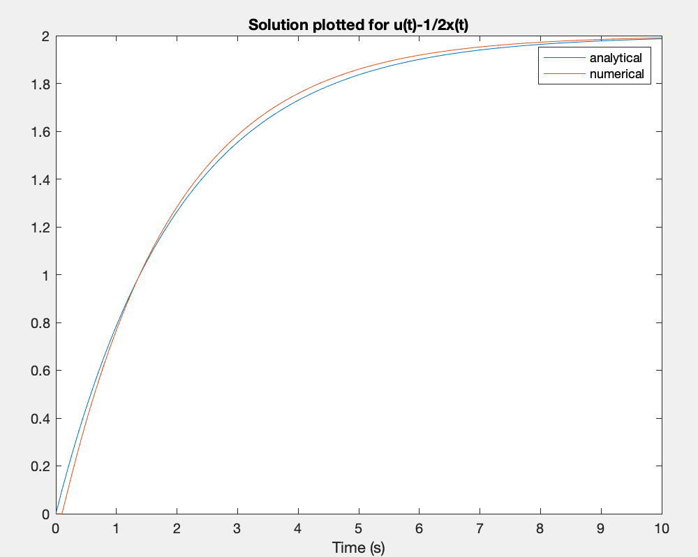

# Numerical Integration using MATLAB

In this tutorial we will compare different methods for integrating a simple differential equation (or model):

$$ \dot{x}(t)=u(t)-\frac{1}{2}x(t) \nonumber $$

Assuming $u(t)=1$ at all time (i.e. $u$ is constant), produce plots of $x(t)$ against $t$ from 0 to 10 seconds in the following ways;

1. **Analytically**: For this simple example an analytical solution is possible, providing us with a useful reference solution to compare numerical results with, for most models, analytical solutions are very difficult or impossible to find. The analytical solution here is;

    $$\int{\frac{1}{1-\frac{x}{2}}dx}=\int{1}dt \nonumber $$

    which gives;

    $$ x(t)=2-2e^{-\frac{1}{2}t} \nonumber$$

2. **Numerically**: Now, using MATLAB, write a short script with a for loop over each time step to use the Euler method for integration with a fixed time step h;

    $$ x(t+h)=x(t)+h\dot{x}(t) \nonumber$$

    Clearly you will also need the equation for $\dot{x}(t)$ at the top of this sheet. You do not need to make use of the analytical solution while doing this.

3. **Numerically using Simulink**: If you have some experience of using Simulink, you can also write a simple block diagram, and let Simulink do the integration for you (you’ll need an integrator block, a constant block and a sum block).

### Questions

* Given that you know the analytical solution is 100% accurate, compare this with the other method(s). What value of the fixed time step, $h$ is needed for method 2) to give an accurate solution?
* Is there any error in the Simulink solution? What if you zoom in to the graph?
* Modify your MATLAB script for solving 2), so that it provides *mid-point* and *RK4* (fixed step) integration. Is the solution better?

Your plots should look something like this;

