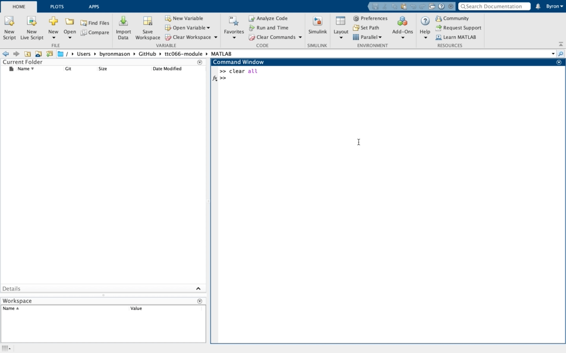
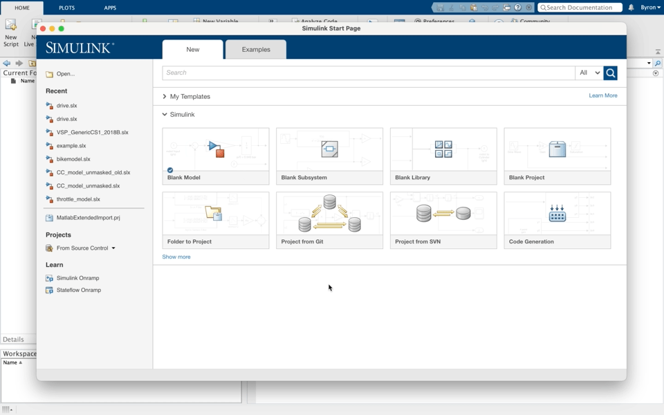
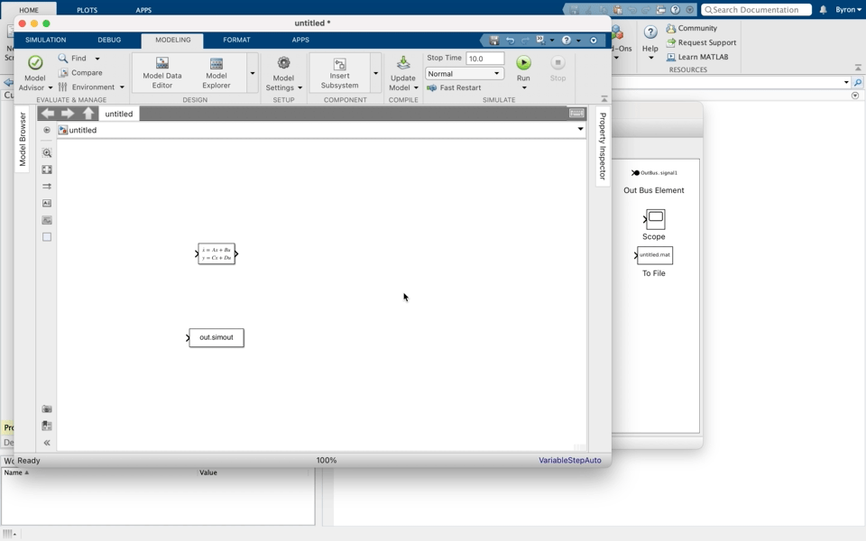

# State Space Simulation

In this tutorial exercise you will be creating a state space model of the body bounce suspension system previously examined in the lecture. This will be implemented in Simulink and simulated to provide some experience of setting up and making use of this type of model.

*Table 1: Model parameter values*

| Parameter | Value | Units |
|---|---|
| K | 17647 | N/m |
| M | 400 | kg |
| B | 1500 | Ns/m |

## Tasks

1. Create a state space representation of the system using the above equations. If you are struggling with this please check the [State Space]({{ site.url}}/ttc066-module/notes/Section_4.html#state-space) topic in the notes.
2. Create a *model_setup.m* script file. Define model parameters, $A, B, C$ and $D$ matrices and initial conditions $z_b=0.1$, $\dot{z}_b=0$.
    

      

        VIEW SCREEN CAPTURE
      

    

    

    

    

3. Using the state space block in the continuous block library of Simulink create a new model and parameterise appropriately with variable names as defined in your script file. Ensure that the simulation results are placed in the workspace as an array using the to workspace block.
    

      

        VIEW SCREEN CAPTURE
      

    

    

    

    

4. Create a *results_plot.m* script file that takes the results from the to workspace block and plots them (with axis labels, legend and title).
5. Using Model Settings >> Model Properties >> callbacks >> initfcn and Model Settings >> Model Properties >> callbacks >> stopfcn add the names of your script files to provide parameters for the model and then plot the results.
    

      

        VIEW SCREEN CAPTURE
      

    

    

    

    

---

Having completed the above, you should have a plot similar to this;

Why so jerky? That’s because the integrator didn’t need to take many steps to get good accuracy. It doesn’t look smooth because the plot command just assumes a straight line between each point it plots. You can get a smoother looking result by specifying a *refine* factor, under *Simulation Parameters*. Setting this to 10 will give 10 output points for each step the integrator has to take to achieve the required accuracy. Another way, which will have benefits if you want to do any frequency domain analysis of outputs from simulation models, is to set a fixed time-step at which you want the outputs calculated. This is done by specifying a value (to replace -1) in the *Sample time* field for each *To Workspace* block (you need to do each separately).

## Self Study

Implement the model with alternative state definition as derived within the lecture.  What are the differences.  Which of the two models in your opinion are the best ones, why?

Challenge; try and configure the solver with settings that make the simulation terminate with an error (crash.  Why do you think that the values entered did this? Post a screen print of your error message in the Teams chat [Oops!](https://teams.microsoft.com/l/channel/19%3a06a36a82d74843d7b2294b60bcf9e9c4%40thread.tacv2/Oops!?groupId=4c8d36f9-c71c-4239-9d11-b9d4a4db72ff&tenantId=cf264fc0-aeb8-449f-9054-82ce4454084b) -> the most interesting error (related to the task) gets a (small) prize!
$$