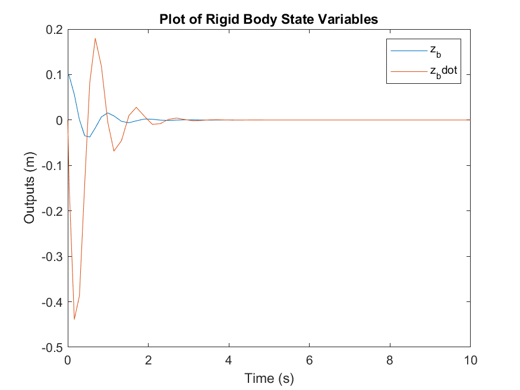

# State Space Simulation

In this tutorial exercise you will be creating a state space model of the body bounce suspension system previously examined in the lecture. This will be implemented in Simulink and simulated to provide some experience of setting up and making use of this type of model.

<hr>


<hr>

*Table 1: Model parameter values*

| Parameter | Value | Units |
|---|---|
| K | 17647 | N/m |
| M | 400 | kg |
| B | 1500 | Ns/m |

## Tasks

1. Create a state space representation of the system using the above equations. If you are struggling with this please check the [State Space]({{ site.url}}/ttc066-module/notes/Section_4.html#state-space) topic in the notes. Remember that the form of the state space equation is $**\dot{x}** = A**x** + Bu$, so the final output of this step should be a 2x2 $A$ matrix and a 2x1 $B$ vector. 
2. Create a *model_setup.m* script file. Assign workspace variables to your model parameters $A$ and $B$ using your outputs from the previous step. 
    <details close markdown="block">
      <summary style="color:green;">
        VIEW SCREEN CAPTURE
      </summary>
    <hr>
    
    <hr>
    </details>

    You will also need to assign a $C$ and $D$ matrix, as per the state space equation $**y** = C**x** + Du$. This is because the "state-space block" in Simulink directly outputs $y$ and not the state values $x$, and so requires that $C$ and $D$ be defined. We are only interested in the values of the states, so the best way to obtain them is to **force** the output to be your states, i.e. $**y** = **x**$. This is done by assigning C and D as follows:
 
$$
C=\left(\begin{array}{ll}
1 & 0 \\
0 & 1
\end{array}\right) \nonumber $$

$$
D=\left(\begin{array}{l}
0 \\
0
\end{array}\right) \nonumber $$


3. You will also need to assign variables for initial conditions in *model_setup.m* , which in this case should be $z_b=0.1$, $\dot{z}_b=0$, $z_r=0$ and $z_rdot = 0$. Remember that we are building a state space model, so you will also need to use these values to compute the initial conditions of the states $x_1$ and $x_2$ using the state equations.

4. Using the state space block in the continuous block library of Simulink create a new model. Open the state space block and assign the parameters ($A, B, C, D$ matrices) and initial conditions of the **states only** in the form of a 2x1 vector .
    <details close markdown="block">
      <summary style="color:green;">
        VIEW SCREEN CAPTURE
      </summary>
    <hr>

    

    <hr>
    </details>

5. Use a "constant" block to provide the input $u$ to the state-space model. This means that the value of $u$ does not change throughout the simulation, and only the states are allowed to vary. Open the constant block and assign the initial condition for $u$ as computed in your *model_setup.m* file.

6.  Ensure that the simulation results are placed in the workspace using the "to workspace" block. If you go into the block you can choose what format to export in.

7. Create a *results_plot.m* script file that takes the results from the to workspace block and plots them (with axis labels, legend and title).

     <details close markdown="block">
      <summary style="color:green">
        ACCESSING SIMULATION OUTPUTS
      </summary>

    Accessing the data sent to the workspace by the "to workspace" block requires a little knowledge about how *data structures* work. The outputs are sent to the workspace in the variable called "out"; if you click on it the variable window will show a list of data objects that are contained inside it, including "tout" and "simout". To access these variables you will need to do "dot referencing", which looks like this:

    ```matlab
    time_data = out.tout;
    x_1_data = out.simout.Data(:,1);
    x_2_data = out.simout.Data(:,2);
    ```
    </details>

8. Go to Model Settings >> Model Properties >> callbacks >> initfcn and add *model_setup* (don't include the file extension). After this, go to Model Settings >> Model Properties >> callbacks >> stopfcn and add *results_plot*. Once you have done this, clicking "run" on the simulink model will also automatically run the setup and plotting scripts.

    <details close markdown="block">
      <summary style="color:green;">
        VIEW SCREEN CAPTURE
      </summary>
    <hr>

    

    <hr>
    </details>

---

Having completed the above, you should have a plot similar to this;



Remember the above plot shows $z_b$ and $\dot{z}_b$ and not the states that are directly output by the simulation. To get the exact same result as this plot you will need to convert the states back into the original variables.

Why so jerky? That’s because the integrator didn’t need to take many steps to acheive good accuracy in $\dot{x}$. It doesn’t look smooth because the plot command just assumes a straight line between each point it plots. 

You can get a smoother looking result by specifying a *refine* factor, under *Simulation Parameters*. Setting this to 10 will give 10 output points for each step the integrator has to take to achieve the required accuracy. 

Another way that will pay off when performing frequency domain analysis of outputs from simulation models is to set a fixed time-step at which you want the outputs calculated. This is done by specifying a value (to replace -1) in the *Sample time* field for each *To Workspace* block (you need to do each separately).

## Self Study

Implement the model with alternative state definition as derived within the lecture.  What are the differences?  Which of the two models in your opinion are the best ones, why?

Challenge; try and configure the solver with settings that make the simulation terminate with an error (crash.  Why do you think that the values entered did this?

