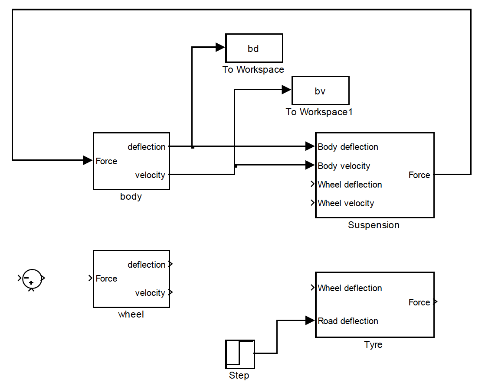
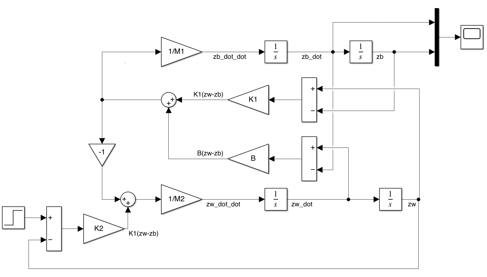

# Suspension System Simulation

The quarter-car ride model is illustrated as shown in the figure below with two masses $M_1$ and $M_2$ representing the sprung mass (vehicle body) and unsprung mass (wheel) associated with a single suspension corner of the vehicle.

$z_b(t)$ represents the vertical deflection of the sprung mass from its equilibrium position (downwards being positive here), $z_w(t)$ similarly refers to the motion of the unsprung mass and $z_r(t)$ represents the input disturbance arising from irregularities in the road as the car moves along.

\\
*Figure: Quarter car suspension model*

The lower spring ($K_2$) represents the compliance of the rubber tyre, and the upper spring ($K_1$) is the main suspension spring. The damper (shock absorber) $B$ provides a force proportional to the relative velocity between $M_1$ and $M_2$.

*Table 1: Suspension system parameter values*

|---|---|
| Sprung mass | $M_1$ | 320 | kg |
| Unsprung mass | $M_2$ | 40 | kg |
| Suspension stiffness | $K_1$ | 18000 | N/m |
| Suspension damping | B | 1000 | $\text{N/ms}^{-1}$ |
| Tyre stiffness | $\text{K}_2$ | $2\times10^5$ | N/m |

## Step 1: Write fundamental equations for deriving a quarter-car model

First consider the suspension force, $F_s$ that will be generated between $M_1$ and $M_2$ if the deflections $z_w$ and $z_b$ are not equal (if they were somehow kept equal, the masses would be moving up and down together, and no force will be generated). Here we define that this force will pull down on $M_1$ and pull up on $M_2$.

1. Draw the force directions on the diagram above, so the sign convention is clear. Your equations, and the success of your model depends on this!
2. Write the equation for $F_s$ in terms of wheel and body deflections and velocities, use a single dot above the variable name to denote velocity.
3. Now following the same principles, write the equation for the tyre force, $F_t$, generated between $M_2$ and the road (assuming the tyre never leaves contact with the road).
4. Now consider the equation $ΣF = Ma$, applied in the vertical direction to each of the masses. The only forces acting are $F_s$ and $F_t$ (see below) and the body equation is simply.

     $$ M_1\ddot{z}_b=F_s \nonumber$$

5. Write the equivalent equation for the wheel.

Note that for these dynamic equations, we ignore the weight of the masses and assume all the deflections are zero at the resting position of the masses (as indicated on the model illustration).

One approach to the above is shown below.  Please do try this for yourselves *before* looking at this. It is important you know how to do it for yourself and once you have seen the answer the opportunity for learning how to do it is *lost*.

  

    VIEW SOLUTION
  

First thinking about $M_1$ (the body).

The sum of forces is just the sum of $F_1$ and $F_2$ from the spring and damper, writing the equation for each of these;

$$ \begin{align}
F_1 &= B(\dot{z}_w-\dot{z}_b) \nonumber \\
F_2 &= K(z_w-z_b) \nonumber \end{align}  $$

Using Newton's equation to determine the acceleration of $M_1$;

$$ M_1 \ddot{z}_b = \sum F = F_1 + F_2 = B(\dot{z}_w-\dot{z}_b) + K_1(z_w-z_b) \label{eq1} $$

Now thinking about $M_2$ (the wheel);

The sum of forces is just the sum of $-F_1$, $-F_2$ and $F_3$ from the spring and damper, writing the equation for each of these;

$$ \begin{align}
-F_1 &= -B(\dot{z}_w-\dot{z}_b) \nonumber \\
-F_2 &= -K_1(z_w-z_b) \nonumber\\
F_3 &= K_2(z_r-z_w) \nonumber \end{align} $$

Using Newton's equation to determine the acceleration of $M_2$;

$$ M_2 \ddot{z}_w = \sum F = -F_1 - F_2 + F_3 = B(\dot{z}_b-\dot{z}_w) + K_1(z_b - z_w) + K_2(z_r - z_w) \label{eq2} $$

So that with Equations \ref{eq1} and \ref{eq2} you have the set of equations that fully describe the system.

## Step 2: Create and test a subsystem for body motion

Start MATLAB and Simulink, then open a new model and build the system shown below. The Sine Wave generator is obtained from the Simulink Block Library under *Sources*, and here we use it to represent an external vertical force applied to an isolated body mass. Set a peak force of 1000 (Newtons) and a frequency of 1 Hz, i.e. $2\pi$ radians per second. Bias, Phase and Sample Time can be left at zero.

The Gain and Integrator blocks are found in the Commonly Used Blocks library. The gain parameter should be set to $\frac{1}{320}$, representing the reciprocal of the body mass. The *To Workspace* block is found in the *Sinks* library, this writes a variable (array) into the Matlab workspace so that it can be plotted later. Before using it, double click the *To Workspace* block and select Save Format as *Array* rather than *Timeseries*, this makes it easier to work with in Matlab.

\\
*Figure: Start of simple Simulink suspension model*

Set the simulation to run for 5 seconds and run it. Use MATLAB to plot the velocity time history (if you need help type `help plot` or `doc plot`). Your plot should look something like that shown in the figure below.

\\
*Figure: Simulation results*

The result is quite coarse. This is because, with such a simple model, Simulink doesn’t need to take very small steps in time (in the integration process) to get accurate results. There are (at least) two ways to correct this, both obtained from menu tabs Simulation → Configuration Parameters from the top of the model window. Changing the Relative tolerance, on the Solver tab, from default $10^{-3}$ to a smaller value, say $10^{-6}$ will force more time steps and a smoother result. This works better with more challenging integration problems, so leave this option for later consideration.

If you don’t need to force greater accuracy, but just refine the look of the output, you can set a refine factor greater than 1 (use 10, say), within the Data Import / Export tab (under Additional parameters).

Modify your Simulink model so it outputs displacement too, then produce a plot with velocity and displacement time histories on the same axes (you can use a mux block to do this). Why do the velocity and displacement time histories look the way they do? Why aren’t they both simply sinusoidal? (Think about the first cycle of Force (and hence acceleration) and what this physically does to the lump of mass.)

Finally remove the Sine Wave and To Workspace blocks,

\\
*Figure: Remove the Sine Wave and To Workspace blocks*

and highlight all of these blocks, then select create a subsystem. Double click the subsystem to re-open it and after re-naming the *inport*, *outport* and *subsystem* you should have something that looks like the figure below;

\\
*Figure: Create a subsystem*

## Step 3: Create and test a linear subsystem for suspension force

Open a new model (blank page) to create this sub-system, which should have four inputs, defining the kinematics (displacement and velocity) of the body and the wheel. The output is to be the dynamic force caused by the spring and damper, acting between the body and the wheel.

*Figure: A new model*

Complete this sub-system, using the linear gains for suspension spring and damper rates given in the table above. This effectively amounts to wiring up the first equation you derived in Step 1. You will only need to use in, out, gain and sum blocks to do this. When you’re finished, highlight all blocks and *Create Subsystem* as before. Save this as *suspension.slx*.

## Stage 4: Complete and test the quarter car suspension model

You can now complete the construction of the quarter-car model quite easily. Open up a new Simulink window, as well as the two earlier windows. Blocks already constructed can be dragged into the new window, without affecting the previous models. The following figure indicates how to lay out the full model, and some, but not all of the top level connections are complete. There’s still some thinking to do though; you need to check the logic of what’s going on before diving into the details.

\\
*Figure: Quarter car suspension model*

Look back at the equations you derived in Step 1 to help you complete the connections. Also note that the wheel dynamics sub-system has the same structure as the body dynamics sub-system and the tyre block is very similar to the suspension block, though we are not including any damping in the tyre. The input (road height) needs to be set from a source block; use a step input here, with a step height of 0.05 (metres).

When you are ready, run the simulation with a 5 second duration, plot $b_d$ and $b_v$ against *tout*, to check you get the correct body response (see figure below). If you don’t get the right response, check that you’ve:

* set all the parameters (in all the subsystems) correctly
* used a sensible refine factor, with no limit to number of points, and with a low relative tolerance in configuration parameters (as discussed earlier in this lab).

When you’ve finished the model, save it as *qvm.slx*.

\\
*Figure: Body deflection and velocity response to a 0.05m step*

Now put two more *To Workspace* blocks in the model, to output the wheel motion and hence produce a single plot which compares body deflection with wheel deflection (don’t plot the velocities) for the same step input. You can overlay these on the same axes, or use the subplot command to subdivide the plot window.

Zoom-in on the plot so you can pick out accurate timings for the peaks in the wheel and body motion oscillations. You should be able to estimate the wheel hop and body bounce (damped) natural frequencies, by looking at the the time for one cycle. Is this in the expected range?

If you are struggling to complete your model then have a look below at an *outline* model.  This is a bare minium working version, as usual please have a go at this yourself *before* revealing the answer.

  

    VIEW SOLUTION
  

  

## Step 5: Construct the equivalent State-space model

Finally, go back to your original equations of motion in Step 1 and rearrange them to eliminate the (intermediate) tyre and suspension forces. You should be able to write an equation for $\ddot{z}_b$ and another equation for $\ddot{z}_w$ which only use velocity and displacement variables. Now make a sensible choice of states (displacements and velocities of the two masses gives four states, which is a valid minimal set) and set the input as the road deflection, $u=z_r$.

$$ \dot{\mathbf{x}}=A\mathbf{x}+B\mathbf{u} \nonumber $$

Now you can check your working by writing out the $A$ and $B$ matrices and remembering;

$$ \mathbf{y}=C\mathbf{x}+D\mathbf{u} \nonumber $$

also write out the $C$ and $D$ matrices to give outputs of body and wheel deflection. Write a short MATLAB script to assign these four matrices (for any given parameter set $K_1$, $K_2$, $M_1$, etc). Start the Matlab script by assigning all the parameters and then use these variable names to form the $A, B, C, D$ matrices. Also (if you haven’t done it this way already) use variable names rather than the numbers themselves in all the appropriate places within your *qvm* model. Ideally models should be set up in a flexible way, so you can easily change parameters in a script to run simulation studies.

Now add a State-Space block (Simulink Continuous library) to your finished *qvm* model. This state space model can be connected to your road deflection input and another *To Workspace* block to record the output.

Your final model should now be two copies of the same quarter-car model which should both produce exactly the same result.  Mathematically they are the same, it’s just that one is written with lots of Simulink blocks and the other compressed into the very efficient linear state-space form. They are both using the same Simulink numerical integration method (set in the Configuration parameters we looked at earlier).

So by running the model (try out some alternative inputs) you can validate your state-space calculations as the outputs should match. You can also see how the outputs change when the parameter settings are varied.

## Final Note

It might seem strange (or pointless) to have created the same model in two different ways, but this is not true. From the Simulink block version you could now easily replace the suspension spring, tyre spring and damper, with look-up tables to represent the (physically more correct) nonlinear response of a real vehicle. You can’t do that at all with a set of $A,B,C,D$ matrices and conversely with the linear state-space matrices it is possible to design a controller, and to look at eigenstructure.
