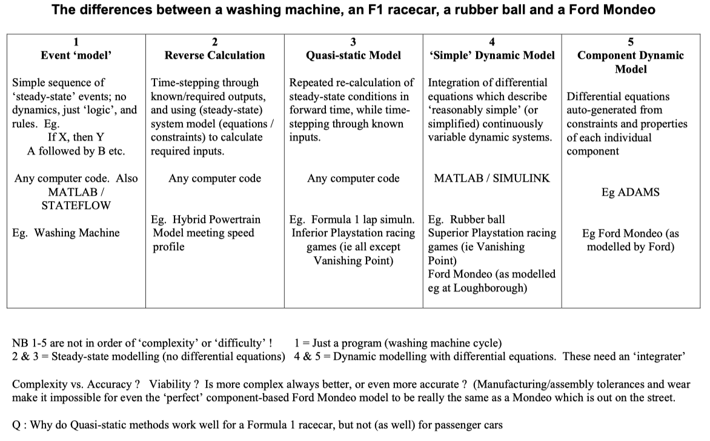

# Section 1: Introduction

## The Role of Systems Modelling

Engineering systems are usually modelled as part of a wider process of decision making.  Naturally, there are advantages in using models to simulate physical behaviour.  For example parametric studies can be undertaken quickly and efficiently (in many cases) for trade-off analysis and optimisation.

Some things need to be considered;

- “All models are wrong - but some are useful” (George Box) - that is, all models have their limitations - so never accept results without question 
- Modelling almost always helps to develop understanding of a system
- The engineer/ modeller decides the valid domain of a model - by careful consideration or by default
- Numerical procedures have their limitations

