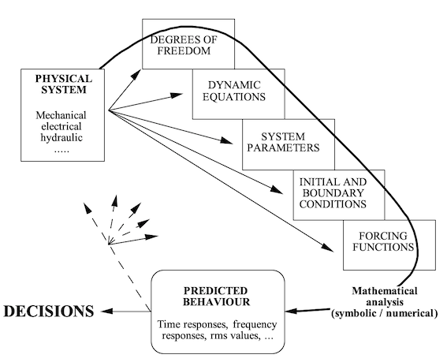

# Section 1: Introduction

## The Role of Systems Modelling

Engineering systems are usually modelled as part of a wider process of decision making.  Naturally, there are advantages in using models to simulate physical behaviour.  For example parametric studies can be undertaken quickly and efficiently (in many cases) for trade-off analysis and optimisation.

Some things need to be considered;

- “All models are wrong but some are useful” (George Box)
- Modelling almost always helps to develop understanding of a system
- The engineer/ modeller decides the valid domain of a model, by careful consideration or by default
- Numerical procedures have their limitations

The table below identifies the differences between a washing machine, an F1 racecar, a rubber ball and a Ford Mondeo

|Event model|Reverse Calculation|Quasi-static Model|Simple Dynamic Model|Component Dynamic Model|
|---|---|
|Simple sequence of steady-state events. No dynamics, just logic and rules e.g. if x then y.|Time-stepping through known/required outputs, and using (steady-state) system model (equations/constraints) to calculate required inputs.| Repeated re-calculation of steady-state conditions in forward time, while time-stepping through known inputs.| Integration of differential equations which describe reasonably simple or simplified continuously variable dynamic systems.|Differential equations auto-generated from constraints and properties of each individual component.|
|Any computer code Also MATLAB / Simulink STATEFLOW| Any computer code | Any computer code | MATLAB/SIMULINK | ADAMS |
|Example: washing machine | Example: Hybrid powertrain model meeting speed profile | Example: Formula 1 lap simulation or inferior Playstation racing games | Example: rubber ball, superior Playstation racing games, MIRA model | Examples: More advanced dynamic vehicle model |
