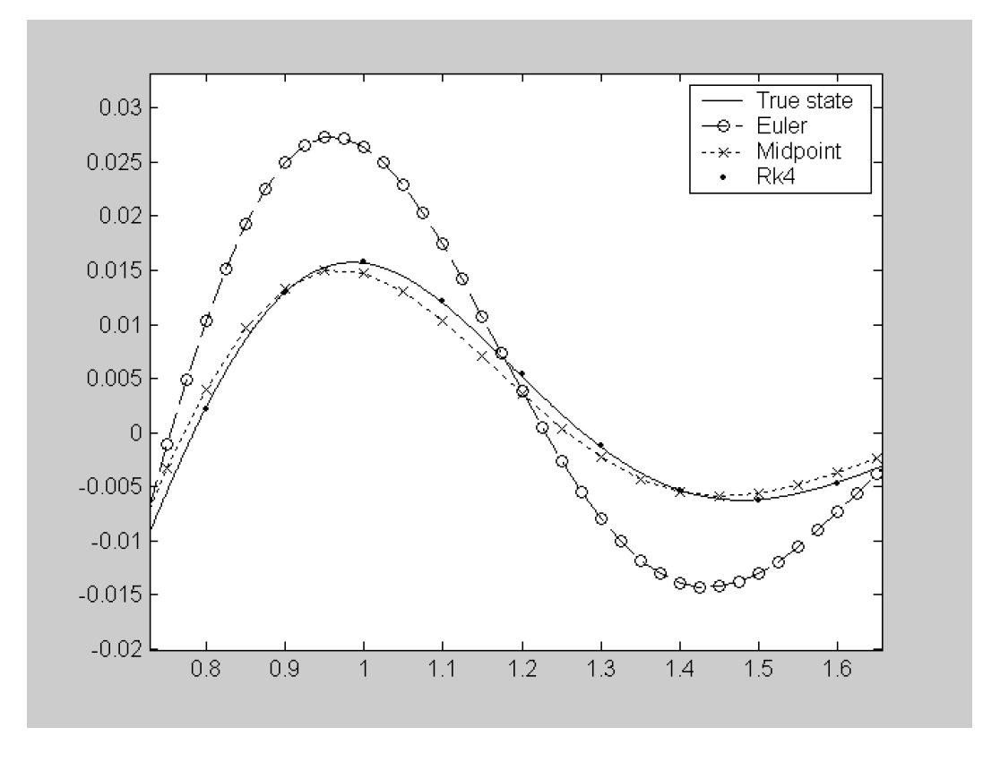

# Section 3: Numerical Integration of Ordinary Differential Equations (ODEs)
{: .no_toc }

  

    Table of contents
  

  {: .text-delta }
1. TOC
{:toc}

The simplest method for integrating a set of differential equations;

$$\dot{\mathbf{x}}(t)=f(\mathbf{x}(t),\mathbf{u}(t))$$

is the Euler method, which is illustrated in Figure 3 below;

$$\mathbf{x}(t+h)=\mathbf{x}(t)+h\dot{\mathbf{x}}(t)$$

where $h$ is a small step in time, $\delta t$.

This method is quite crude because the time derivatives $\dot{\mathbf{x}}(t)$ continuously varies over time yet we are assuming they are constant for the small step $h$.

Euler is too simple because;

- Accuracy can only be ensured by choosing a ‘small enough’ step size and thus imposing a large number of function evaluations on the simulation.
- If $h$ is too large, the solution can become unstable as well as inaccurate, with progressively larger values of $\mathbf{x}$ being predicted.
- The absolute level of accuracy is determined by the model (how rapidly $\dot{\mathbf{x}}(t)$ varies and whether it includes *sharp* nonlinearities* like in the bouncing ball) so it is hard to guarantee a given level of precision.

*Figure 3: Different methods used for numerical integration*

Figure 3 above (b) shows a better method, the midpoint method or Runge Kutta second order. Intuitively, if you find the gradient half way along a step and use this instead of the gradient at the start you will get a better estimate of the average behaviour over the time interval;

$$\begin{aligned}
\mathbf{k_1}&=hf(\mathbf{x}(t), \mathbf{u}(t))\\
\mathbf{k}_2&=hf(\mathbf{x}(t) + \mathbf{k}_1/2, \mathbf{u}(t+h/2))\\
\mathbf{x}(t+h)&=\mathbf{x}(t)+\mathbf{k}_2+ \mathcal{O}(h^3)
\end{aligned}$$

The $\mathcal{O}(h^3)$ means errors of order $h^3$. Essentially the Euler method uses one function $f(\mathbf{x}(t),\mathbf{u}(t)))$ evaluation and is accurate to order $h^2$, the midpoint method uses two (hence second order), and is accurate to $\mathcal{O}(h^3)$, etc.

By far the most often used is the fourth order Runge-Kutta formula (RK4), which is illustrated in Figure 3c and is calculated as;

$$\begin{aligned}
\mathbf{k}_1&=hf(\mathbf{x}(t), \mathbf{u}(t))\\
\mathbf{k}_2&=hf(\mathbf{x}(t)+\mathbf{k}_1/2, \mathbf{u}(t+h/2))\\
\mathbf{k}_3&=hf(\mathbf{x}(t)+\mathbf{k}_2/2, \mathbf{u}(t+h/2))\\
\mathbf{k}_4&=hf(\mathbf{x}(t)+\mathbf{k}_3, \mathbf{u}(t+h))\\
\mathbf{x}(t+h)&=\mathbf{x}(t)+\mathbf{k}_1/6+\mathbf{k}_2/3+\mathbf{k}_3/3+\mathbf{k}_4/6+\mathcal{O}(h^5)
\end{aligned}$$

This method involves four function evaluations; one at the start, two in the centre and one at the end of the step, and it uses a weighted aggregate to provide the best estimate of the states at $t+h$.

The Runge Kutta methods are better than Euler, because they include *autocorrection* within a single time step, hence one RK4 step of length $h$ will be more accurate that four Euler steps of length $h/4$.

The graph on the right illustrates this. It shows a section of simulations of the suspension model, settling from an initial deflection of the body.

The *true states* were calculated using RK4 with a step length of $0.001$. RK4, midpoint and euler methods were then tested with equal numbers of function evaluations (RK4 $h=0.1$, Midpoint $h=0.05$ and Euler $h=0.025$)

*Figure 4: A fair comparison between integration methods*

How do we know what step length we need to achieve a particular level of accuracy though? In general, it isn’t appropriate to fix $h$, and the plot below shows why. The bouncing ball model has a ‘sharp’ nonlinearity – the model changes suddenly when the ball contacts the floor. In the figure, Simulink has been used to give an ‘accurate’ simulation of the motion of the ball after it is released from rest at a height of one metre. The top plot shows vertical height ($m$) against time, the bottom shows speed ($m/s$). One dot is given per timestep taken – note that the step length is significantly shortened during the time when the model is switching between contact and non-contact conditions. The other traces are given by fixed step-length RK4 simulations.

For RK4, $h=0.1$, the time step between function evaluations is too long – the integrator models the ball as in freefall ‘just before’ it hits the ground, then at the next function evaluation the ball has ‘fallen through the floor’, so immediately has a very high spring force applied – this explains the subsequent motion, where the ball flies off into the air at great speed (this is slightly unrealistic behaviour). In the second case, $h=0.03$ because for most of the simulation this is the step length the Simulink integrator uses. Similar problems occur again; although it’s not as severe, clearly this model is incorrect, as again the simulation shows the ball gaining energy.

*Figure 5: Ball bounce solver comparisons*

It is clear from this example that, however the model is structured, it is essential we have control over the accuracy we are getting. This means integrators have to include an algorithm which automatically adapts the step lengths taken.

## Adaptive step size control

A good ODE integrator should exert some adaptive control over its own progress, making frequent changes in its step-size. The simplest way of getting information on accuracy is to perform two small steps $(h)$ and also one double step ($2h$), and compare between the final solutions at $x(t+2h)$. This requires a total of 11 function evaluations (not 12 because the first small step shares its first function evaluation with that of the large step). Compared with not making the large step the three extra function evaluations cost 37.5\% more computing, but pay dividends in guaranteeing precision, and allowing longer time-steps where possible.

Denoting $x_a$ and $x_b$ as the one and two step solutions respectively, the true value of $x(t+2h)$ is given by;

$$ \mathbf{x}(t+2 h)=\mathbf{x}_{a}+(2 h)^{5} \varphi+\mathrm{O}\left(h^{6}\right) \\[12pt]
\mathbf{x}(t+2 h)=\mathbf{x}_{b}+2\left(h^{5}\right) \varphi+\mathrm{O}\left(h^{6}\right) \label{eq9} $$

where, to order $h^5$, the value of $\varphi$ stays constant over the step. We can now define an error estimate;

$$\varepsilon=\mathbf{x}_b-\mathbf{x}_a$$

but note that we can also solve Equation \ref{eq9} to give an improved fifth order estimate for the states;

$$\mathbf{x}(t+2h)=\mathbf{x}_b+\frac{\varepsilon}{15}+O(h^6) \label{eq10}$$

The error gives a measure of fourth order accuracy, but the state evaluation actually has fifth order accuracy; this is why adaptive stepsize algorithms, like those in Simulink (see Simulation Parameters in the block diagram menu) refer to their algorithms as RK4/5 (or ODE45 in Simulink).

To adapt the stepsize, consider the order of errors in RK4; $\varepsilon$ is of order $h^5$ (Equation \ref{eq9}), so;

$$\varepsilon=ch^5$$

where $c$ is some unknown constant. If we desire a particular accuracy level, $\varepsilon_{des}$, this would be related similarly to the step length required to achieve it;

$$\varepsilon_{des}=ch_{des}^5$$

Eliminating $c$, we have;

$$h_{des}=h\left(\frac{\varepsilon}{\varepsilon_{des}}\right)^{1/5} \label{eq11}$$

Thus to guarantee a minimum accuracy $\varepsilon_{des}$ we could perform the two small and one big steps at the current best guess step-length $h$, then use Equation \ref{eq11} to give $h_{des}$, the step-size that would have met the required accuracy over that step. If $h_{des} < h$, the accuracy was not good enough, so the step should be repeated with the new $h$. Conversely, if $h_{des} >= h$, accuracy was good enough (so there’s no need to repeat the step) and we can afford to increase the step length on the next step taken.

The problem is slightly more complicated than it seems though, because, from Equation \ref{eq10}, $\varepsilon$ is actually a vector (one value per state) so further decisions might be needed; do we use the largest absolute error in Equation 11, or is $\varepsilon_{des}$ scaled according to expected values of the states (some states may have much larger values than others)?

## Alternatives (particularly for ‘stiff’ systems)

In my source for this section of the notes [2], the authors comment that, ‘For many scientific users, fourth order Runge Kutta is not just the first word on ODE integrators, but the last word aswell’, and this is true for most applications that you might use (you’ll rarely need to change the integrator away from ODE45 in Simulink). Be aware that there are alternatives though, with exotic names like Bulirsch-Stoer predictor-corrector’ and Runge-Kutta Fehlberg ‘localextrapolation’ (the latter has largely superceded RK4 as described in these notes – and is probably at the heart of Simulink’s ODE45 – but the principles are very similar).

The major ‘alternative’ which you may actually need for certain types of model, are the class of integrators designed for ‘stiff’ systems – that is, systems which have some relatively slow dynamics and some very fast dynamics. A practical example might be in the simulation of a suspension system, where the wishbone mounting bush forces are dynamically modelled as high rate springs, along with the main spring and damper. A simple mathematical example of a stiff system is:

$$\begin{aligned}
\dot{x}_1&=998x_1+1998x_2\\
\dot{x}_2&=-999x_1-1999x_2
\end{aligned}$$

which has analytical solution:

$$\begin{aligned}
x_1&=2e^{-t}-e^{-1000t}\\
x_2&=-e^{-t}+e^{-1000t}
\end{aligned}$$

Here, very small step sizes, $h \ll 1/1000$ are needed to deal with the $e^{-1000t}$ term, yet this term has negligible effect on the solution unless $t$ is very small. Interestingly, it isn’t sufficient to just allow for very small $h$ near to $t=0$; the use of RK4 on such a system leads to instability because of the nature of the model. Poor conditioning in the model is another way of referring to the problem, $\dot{x}_1$ and $\dot{x}_2$ and are very sensitive to a particular combination of errors in $x_1$ and $x_2$.

The solution is to use ‘implicit’ methods, where the model is rearranged such that the state estimate at time $t+h$ is calculated in terms of the derivative at $t+h$, not the derivative at $t$. A simple example is;

$$\dot{x}(t)=-cx(t)$$

where $c$ is again some constant. The explicit (or forward differencing) Euler method uses;

$$x(t+h)=x(t)+h\dot{x}(t)=(1-ch)x(t)$$

The implicit Euler method uses backward differencing, such that;

$$x(t+h)=\frac{x(t)}{1+ch}$$

There is an overhead in the equation rearrangement (which is automated by the solver, not performed by the model designer), so implicit methods are not used for all systems, but they do provide guaranteed stability, and hence allow numerical solutions for ‘stiff’ systems. The stiff solvers in Simulink are denoted with suffix ‘s’ in their name (eg ODE15s) and of course, these use more elaborate algorithms that Euler!
