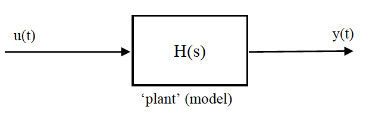

# Section 4: Linearity and State Space
{: .no_toc }

  

    Table of contents
  

  {: .text-delta }
1. TOC
{:toc}

## Linearity

You may have come across this in control and other modules. It is a very important concept which needs to be kept in mind whenever you analyse a system and its responses. The good news is that if a system is linear, there are a number of very useful tools you can use to interpret its behaviour, and you can simulate it very easily. But, most systems aren’t actually linear in practice. This isn’t the disaster it sounds though, because many systems can usefully be approximated as linear.

A system is linear if it satisfies the [superposition principle](https://en.wikipedia.org/wiki/Superposition_principle) which is the same as saying that it obeys the rules of homogeneity and additivity.  

The rule of homogeneity says that an increase (scaling) of an input, $x$ applied to a system, $f$ (actually system defined by a function) should result in an equivalent scaling of the output, $f(x)$. Another way of saying this is that if you double the input to a system you should see a doubling of the output.

$$ f(ax)=af(x) \nonumber$$

The additivity rule is is a bit more involved but essentially says that if you apply two different inputs, $x_1$ and $x_2$ to the system separately then the sum of outputs produced, $f(x_1)$ and $f(x_2)$ is the same as the output you would see if you were to apply the same inputs together, $f(x_1 + x_2)$.

$$ f(x_1+x_2)=f(x_1)+f(x_2) \nonumber$$

Why does the above matter?  It makes things more simple.  Four our ODEs it means that the state differential equations for a linear system can always be written as linear combinations of the states and inputs, i.e.;

$$ \begin{split} &\dot{x}_1=a_{11}x_1+a_{12}x_2+a_{13}x_3+...+b_{11}u_1+b_{12}u_2+...\\
&\dot{x}_2=a_{21}x_1+a_{22}x_2+a_{23}x_3+...+b_{21}u_1+b_{22}u_2+... \end{split} \nonumber $$

where all the $a_{ij}$ and $b_{ij}$ are constants. There are no terms in $x^2$, no $sin(x_i)$ or any other function, no saturations and no lookup tables for $\dot{x}$ as a function of $x$.

The suspension model in [Section 2]({{ site.url}}/ttc066-module/notes/Section_2.html) is linear, but the bouncing ball model is not (although it is linear within each of the two conditions it switches between), you can’t use either of these linear models for a whole simulation, so there is little benefit in analysing its response under either linear model separately. Useful linear analysis can only be conducted on so called *linear time-invariant* (LTI) systems.

## State Space

The state space representation of a system is written in a matrix form;

$$ \dot{\mathbf{x}}=A\mathbf{x}+B\mathbf{u} \label{eq12a}$$

$$ \mathbf{y}=C\mathbf{x}+D\mathbf{u} \label{eq12b} $$

Ignoring the Equation \ref{eq12b} for now, the first is just an efficient way of storing a whole model in two matrices. Revisiting the suspension model example already discussed in [Section 2]({{ site.url}}/ttc066-module/notes/Section_2.html) and included below for reference;

  

    OPEN FOR EXAMPLE
  



If we write out Equation \ref{example_1:eq3} of the model above but include a coefficient for every possible state and input, and put them in order, we have;

$$\begin{aligned}
&\dot{x}_{1}=0 x_{1}-1 x_{2}+1 u_{1} \\
&\dot{x}_{2}=\frac{K}{M} x_{1} - \frac{B_{s}}{M} x_{2} + \frac{B_{s}}{M} u_{1}
\end{aligned} \nonumber $$

and the state space model $A, B$ is given by;

$$\dot{\mathbf{x}}=\left(\begin{array}{cc}
0 & -1 \\
\frac{K}{M} & \frac{-B_{s}}{M}
\end{array}\right) \mathbf{x}+\left(\begin{array}{c}
1 \\
\frac{B_{5}}{M}
\end{array}\right)u \label{eq13} $$

There are two states, so $A$ (which is always square) has size $2\times2$ and only one input.  The alternative (longer) form for the same model was described in Equation \ref{example_1:eq2a} in the example above. In longhand this becomes;

$$\begin{aligned}
&\dot{x}_{1}=0 x_{1}+1 x_{2}+0 x_{3}+0 u_{1} \\
&\dot{x}_{2}= -\frac{K}{M}x_{1} -\frac{B_{s}}{M} x_{2} + \frac{K}{M} x_{3}+\frac{B_{s}}{M} u_{1} \\
&\dot{x}_{3}=0 x_{1}+0 x_{2}+0 x_{3}+1 u_{1}
\end{aligned} \nonumber $$

so;

$$\dot{\mathbf{x}}=\left(\begin{array}{ccc}
0 & 1 & 0 \\
\frac{-K}{M} & -\frac{B_{s}}{M} & \frac{K}{M} \\
0 & 0 & 0
\end{array}\right) \mathbf{x}+\left(\begin{array}{c}
0 \\
\frac{B_{5}}{M} \\
1
\end{array}\right)u \label{eq14} $$

Note that you can have two different sets of matrices which both describe the same model, the definition of the state vector is different in each case, so the model will be different in structure, but it will have the same output. The states can be seen as *intermediate variables*, they are a set of variables which provide a full description of the modelled dynamics but aren’t unique.

In many situations we consider the system as a transfer function between input(s) and output(s);

As the states may vary depending on how you set the model up, Equation \ref{eq12b} is used to *map* the states into one or more recognisable outputs. Matrices $C$ and $D$ are not essential but they do let you define a system from input to output. For example, for the outputs to be $y_1 = z_r-z_b$ = *suspension deflection* and $y_2 = \dot{z}_b$ = *absolute body velocity*, the following *mapping* is required;

$$ \begin{split} &y_1=x_1 \\
&y_2=x_2 \end{split} \nonumber $$

so for the two state model above (Equation \ref{eq13}) it follows that;

$$
C=\left(\begin{array}{ll}
1 & 0 \\
0 & 1
\end{array}\right) \nonumber $$

$$
D=\left(\begin{array}{l}
0 \\
0
\end{array}\right) \nonumber $$

If you are struggling to follow the above look back at Equation \ref{eq12b} and see how the matrix $C$ multiples the state vector, $\mathbf{x}$, remembering that this is a vector of states, $x_1, x_2, ...,$ etc. The values in $C$, in this simple case could be seen as switching *on* or *off* each of the states, $\mathbf{x}$ as they map to the output vector, $\mathbf{y}$. Be careful though with this simple thinking since it does get a bit more involved, as shown below.

To output the same values from the three state version of the model (Equation \ref{eq14}), you need;

$$
C=\left(\begin{array}{ccc}
-1 & 0 & 1 \\
0 & 1 & 0
\end{array}\right), \quad D=\left(\begin{array}{l}
0 \\
0
\end{array}\right) \nonumber $$

You can also get body acceleration, $\mathbf{\ddot{z}_b}=\dot{x}_2$, from this model, the equation for this is the second equation of the model. Adding this as a third output (to the three state model);

$$
C=\left(\begin{array}{ccc}
-1 & 0 & 1 \\
0 & 1 & 0 \\
-K / M & -B_{s} / M & K / M
\end{array}\right), \quad D=\left(\begin{array}{c}
0 \\
0 \\
B_{s} / M
\end{array}\right) \nonumber $$

You can see that the second row of [A : B] is simply placed in the third row of [C : D]. Note that the matrix sizes are such that you can always put A, B, C and D together, to build a rectangular matrix;

and you can think of the inputs going in, outputs coming out, and states churning around as drawn above. This has no practical use, but helps you remember how big the $D$ matrix needs to be (this is often just full of zeros).

It is possible to output anything you want from a properly defined state space model (as a linear combination of the states and inputs). But, try outputting $z_b$ from the two state version. You can’t, because $z_b$ alone does not have an independent influence on the system’s dynamic response, and the number of states has been minimised to take advantage of this fact (using the combination $z_b$ – $z_r$). This is not a problem, because you wouldn’t normally be interested in variables which have no direct dynamic influence and if you did, you could code extra states, like in the three state version.

 <b>References</b>  [1] Thomas D. Gillespie, ‘Fundamentals of Vehicle Dynamics’, SAE, 1992.  [2] W.H.Press, S.A.Teukolsky, W.T. Vetterling and B.P. Flannery, ‘Numerical Recipes, The Art of Scientific Computing’, Cambridge University Press, 1992.
