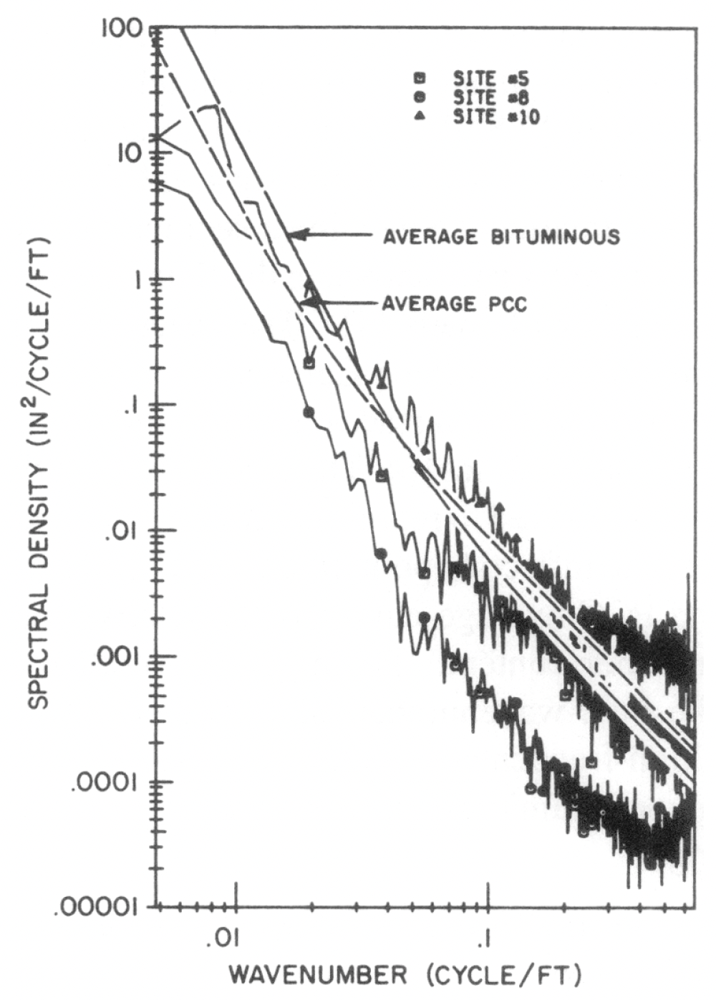

# Section 5: Ride Dynamics
{: .no_toc }

  

    Table of contents
  

  {: .text-delta }
1. TOC
{:toc}

These notes are an extremely condensed and reduced version of Chapter 5 from Thomas D.
Gillespie’s ‘Fundamentals of Vehicle Dynamics’. It is well worth reading this chapter (and others) from the book – although you have to get used to American rather than SI units ! All the figures in this section come from the book.

## The Ride System

*Figure 1: The ride system8

This figure illustrates one of the most basic concepts in modelling and simulation, yet one which can still cause confusion. The Excitation Sources are the inputs to the system. These might be illustrated in the time domain, but are more often shown in the frequency domain (eg as a Power Spectral Density, PSD plot). The system (or model) then reacts to these inputs, ‘converting them’ into Perceived Ride in this case – which might itself be shown in terms of a measurable output, such as vehicle body vertical acceleration.

## Excitation: Road Roughness

The principal excitation source, obviously, is the road. Figure 2 shows a PSD of three measured roads along with average frequency models for them. The frequency model is;

$$G_{Z}(v)=\frac{G_{O}\left[1+\left(v_{O} / v\right)^{2}\right]}{(2 \pi v)^{2}}$$

where;

$G_z(\nu)=$ PSD amplitude $[feet^2/cycle/foot]$\
$\nu=$ Wavenumber $(cycles/foot)$\
$G_0=$ Roughness magnitude parameter $(1.25\times10^5$ for rough roads, $1.25\times10^6$ for smooth)\
$\nu_0=$ Cutoff wavenumber ($0.02 \space cycle/foot$ for rough roads, $0.05 \space cycles/foot$ for smooth)\

\\
*Figure 2: Typical spectral densities of road elevation profiles*

The simple model can be used, along with a random number sequence, to generate test roads which are random in themselves, but yet have approximately representative frequency content. Multiplication of the original ‘wavenumber’ (cycles per foot) by a known (and assumed constant) vehicle speed (feet per second) gives a more recognisable PSD;

*Figure 3: Elevation, velocity and acceleration PSD's of road roughness input to a vehicle travelling at 50mph on a real and average road*

## Excitation : Secondary effects

Vibration from ‘imperfection’ of the wheel or driveline, and from the engine, cause further excitations, usually at frequencies higher than the principal wheel-hop and body-bounce modes that we are most interested in. Note this figure illustrating wheel runout; although the tyre is ‘complex’, the model is just a collection of simple springs – we’ll see this is quite common in basic vehicle dynamic modelling.

*Figure 4: The radial spring model*

‘Runout’ refers to the ‘springs’ expanding and contracting – any unevenness causes an effect similar to wheel mass imbalance, giving a cyclical input at the frequency of the wheel rotation speed. Harmonics of the ‘multiple spring’ model can also cause cyclical disturbance – did you know tyres are sometimes square?

*Figure 5: Radial nonuniformities in a tyre*

## The simplest Ride model : The Quarter Car

Although simple, the quarter car model is adequate, and can be an accurate representation of real vehicle vertical motion (depending on correct setting of the parameters). This is the first model that we will build and analyse on this course.

*Figure 6: Quarter car model*

Typical values of parameters - large saloon;

M = 300kg\
m = 30kg\
K_s = 20000Nm\
K_f = 160000N/m\
C_s=1500Ns/m

In order to perform some quick hand calculations on the expected frequencies and damping ratios that given parameter choices will provide, we can also think of the quarter car model in terms of modal (not model !) simplications. To consider body-bounce, or wheel-hop alone;

*Figure 7: The quarter car model*

You used these simple equations in Part B dynamics. Firstly in the body-bounce variant, the unsprung mass is assumed zero, and the tyre and suspension springs are thus in series.

$$ K_{b b}=\frac{K_{s} K_{t}}{K_{s}+K_{t}} $$

This gives a natural frequency for the body-bounce mode of :

$$ \omega_{n}=\sqrt{K_{b b} / M} $$

in $[\mathrm{rad}/\mathrm{s}]$ (divide by $2\pi$ to give natural frequency in Hz).  The ‘actual’ (damped natural) frequency of vibration is affected by the damping ratio, $\zeta$

$$ \omega_{d}=\omega_{n} \sqrt{1-\zeta^{2}} $$

which is given according to the damping constant actually used ($B_s = C_s$)

$$ \zeta=C_{s} / \sqrt{4 K_{b b} M} $$

Typically, a damping ratio of between 0.2 and 0.4 is achieved. What is the natural frequency, and damping ratio for the ‘large saloon’ figures given above ?

Looking at the ‘Wheel-hop only’ variant, here we assume that the sprung mass, M hardly
moves at all, so the unsprung mass, m is governed by suspension and tyre springs in parallel;

$$ K_{w h}=K_{s}+K_{t} $$

and;

$$ \omega_{n}=\sqrt{K_{w h} / m} $$

in $\mathrm{rad} / \mathrm{s}$. Expected in the range 11 – 13 Hz, what is the wheel-hop frequency here?

### Ride Response

Figure 8 illustrates, from left to right, input, model and output. The input and output here are the PSDs of road acceleration and vehicle acceleration respectively. (Note that it is possible to look at responses between different input/output combinations, provided the model is suitably written – eg in state space.) The model shows the gain function (frequency response, or ‘bode plot’ gain) between the two. Note how the road accel essentially looks similar to that given in Figure 3, with high magnitudes at high frequencies. These high frequencies are not transmitted through the suspension, whose principal job is to isolate the vehicle body from harsh inputs. In
the model plot you can see the obvious body bounce resonance, around 1Hz, and the kink around 10Hz showing the wheel hop resonance (we will see later, when looking at eigenstructure, that both modes of vibration affect both masses, at least to some extent). The output PSD shows how well the system has attenuated the high frequencies, whilst magnifying the response around 1Hz. You can look at the plots as ‘input x model = output’, although you should bear in mind that, because we are viewing PSDs of input and output, which give their signal squared, the true ‘maths’ is $input PSD x |model|^2 = output PSD$.

*Figure 8: Isolation of road acceleration by a quarter car vehicle model*

### Suspension Stiffness and Damping

The magnitude of the body bounce peak is affected by what Gillespie refers to as the ‘ride rate’,
$K_{bb}$ above. Because $K_s$ and $K_t$ act in series, and $K_t$ is so much stiffer than $K_s$, $K_{bb}$ is dominated by $K_s$. In Figure 9 below, $K_s$ has been tuned to give a body bounce resonance frequency varying from 1Hz to 2Hz (without varying damping factor). This shows that as you increase the resonance frequency for body bounce, so the transmission of acceleration from the road to the vehicle will increase in magnitude – by a large factor. The y axis here is on a linear scale, so you can look at the area under the peak as a measure of the mean-square acceleration transmitted from road to vehicle. Obviously, the aim is to achieve good isolation, and reduce transmission, so lower $K_s$, and hence lower resonance frequencies are aimed for.

*Figure 9: On road acceleration spectra with different sprung mass natural frequencies*

The factors which prevent excessively low $K_s$ and hence lower ride rates are:

* Suspension travel – low spring rates necessitate greater suspension travel.
* Handling performance is affected by fluctuating vertical load on the tyre.
* Very low frequencies (well below 1Hz) would induce nausea (1 and 2 above restrict the frequency more than this factor).

Figure 9 isn’t totally ‘honest’ however, as the damping in the suspension can always be increased, along with the suspension spring rate, to counter the high body bounce peak. The introduction of damping isn’t a ‘simple’ solution though, because it reduces isolation at higher frequencies. Increases in damping essentially spread the range of frequencies through which vibrations are transmitted, whilst reducing the peak at a given (in this case body bounce)
resonance;

*Figure 10: Effect of damping on suspension isolation behaviour*

Figure 10 shows the effect of increasing $C_s$ to give damping ratio, $\zeta$ in the range 0.1 to 2. Note how at the extreme (200% damping) level, the ‘stiff’ damper has effectively tied the body and wheel together, combining body bounce and wheel hop into one resonance at about 3.5Hz. This would be highly undesirable, due to its affect on our own body ‘system’. 1Hz and 10Hz feels a lot better than 4Hz vertically.

### Active Suspension

A little ‘aside’ – although it is expensive to fit and run (in terms of fuel) controllable force
generators (such as hydraulics, hydro-pneumatics). They can, at least in theory, provide exceptional reductions in body bounce vibration transmission. Note that, interestingly, it is less easy to control the wheel hop peak.

*Figure 11: Quarter car model of active and passive suspension*

*Figure 12: Comparison of vertical acceleration of active and passive systems*

### Bounce and pitch in combination

The quarter car model is good for investigating ‘bounce only’ motion of the vehicle, but more complex models are needed to give a more complete insight into why suspensions are designed the way they are. The natural progression is to include pitch motion, using the ‘half car’ model. Note that, although the analysis and discussion of this system gets more complicated – with front and rear suspensions being tuned to complement each other to give both desirable pitch and bounce – the model is not much more complicated. Figure 13 shows that we need only a rigid beam suspended on two springs to get a useful simulation model. The equations for this type of system have, once again, been derived in Part B dynamics.

*Figure 13: Pitch plane model*

I won’t get into the details of how the pitch and bounce modes behave, and how the ride rates of front and rear can be tuned here. Gillespie does an admirable job within a few pages in his book. It is worth noting a few basic issues though;\
a. Wheelbase filtering\

*Figure 14: The wheelbase filtering mechanism*\
Figure 14 shows how the spacing of the front and rear suspensions can couple with the wavelength in the road to give ‘just bounce’ and ‘just pitch’. The effect is not really significant in practical terms, (very few roads look like single sinusoids) but it is an effect worth understanding when it comes to interpreting PSDs or frequency responses from more complex
systems.\
b. Position and direction of measurement\
What you feel depends on where you are and in what direction you are interested and the type of motion. When we looked at the quarter car, we consider only vertical motion, but think about the simple beam of Figure 13 in pitch motion about its centre of gravity; if you ‘sit’ at the centre the rotation causes no motion. If you are above the centre of gravity the acceleration is fore-aft (not vertical), and only at the ends does pitch look ‘mostly  vertical’. It is interesting to note that the principal ‘problem’ associated with pitch is the fore-aft motion it produces for the passengers (not the vertical) – in spite of the much smaller ‘moment arm’.\
c. Lower ride rate at the front than the rear
A neat way of reducing the discomfort of pitching (pitch being worse than bounce, generally) is to make the front ride rate lower than the rear:

*Figure 15: Oscillations of a vehicle passing over a road bump*

With this design, as you meet a disturbance, you induce pitching instantaneously, but with the
rear suspension motion ‘faster’ than the front, the motion resolves itself into bounce. Effectively, the rear oscillations ‘catch up with’ those at the front, eliminating the phase lag that the constant delay in the wheelbase has caused.

d. Design ‘rules of thumb’ vs Modelling, simulation and analysis
Gillespie quotes one of the founders of modern vehicle dynamics, Maurice Olley, who came up with a number of design guidelines for ‘good ride’ from vehicle suspensions. I am absolutely confident that these constitute valuable advice which is almost certainly still used today (and you may have come across them in vehicle design modules). There is nothing wrong with using these guidelines, but you should also remember that, from Figure 6 (quarter car) and Figure 13 (half car) it is also very easy to build useful simulation models, and hence run your own simulations. From these it is possible to perform a wide range of analysis, as we will see later in this module, and hence to widen your understanding of the behaviour. You can test the guidelines and assumptions that others recommend, you can examine the influence of parameter changes and you can carry out ‘what if’ experiments. It is for this reason that this module concentrates on building your simulation skills rather than (only) getting you to
remember useful facts and figures!

### Human Perception

We have looked at the PSD of ride (vertical) accelerations, and the models of suspensions
which give rise to these, across frequency. In order to complete the picture about how vehicles
should be designed however, we also need to consider the dynamics of the human body.
Vibrations start at the road, or in the vehicle, and travel through the system of the vehicle (eg
tyres, suspension) to the passenger compartment. From this point, the vibrations travel through
the seat and passengers body before they are actually registered by the brain as uncomfortable.
Thus we should consider the system of the body too.

One way of doing this is to subject people to vibration in an experiment, and then get them to
rate how uncomfortable each vibration is. In practice, this is done by testing one frequency at a
time, and building up a map of discomfort. The three plots below show lines of equal tolerance
to various frequencies (x axis) applied at different amplitudes (y axis). The first two relate to
vertical (ride) motion, and the last one relates to fore-aft motion (pitch, and also shuffle – see
longitudinal (driveline) dynamics later in this course).

*Figure 16: Human tolerance limits for vertical vibration*

*Figure 17: NASA discomfort for vibration in transport vehicles*

*Figure 18: Human tolerance limits for fore/aft vibrations*

A couple of very basic conclusions:

1. The NASA results correlate with vertical resonance frequencies of the organs of the human body in the abdominal cavity (ie your guts !) which lie in the range 4 – 8 Hz. This helps to explain why we have vehicle ride dynamics with resonance at 1Hz and 10Hz, (avoiding this range) and why the 200% damping solution in Figure 10 would be a
disaster!
2. Fore – aft tolerance is not the same as vertical tolerance. Fore-aft vibrations cause most concern at lower frequencies (1 – 2 Hz) and less concern as the frequency rises.
