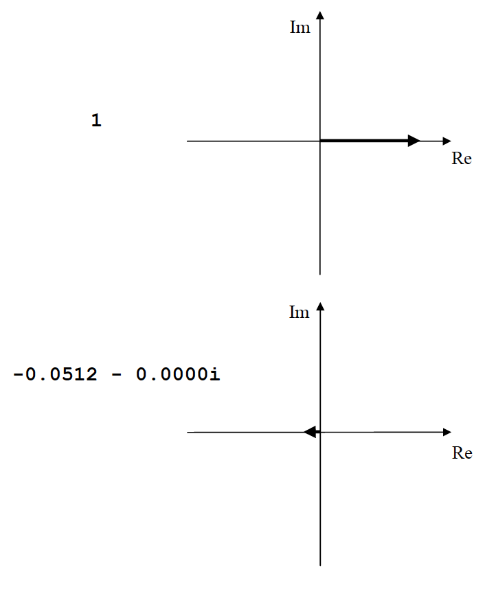

# Section 6: Using Eigenvalues and Eigenvectors
{: .no_toc }

  

    Table of contents
  

  {: .text-delta }
1. TOC
{:toc}

## Useful Properties of State Space: Eigenstructure

Right now it might seem rather a lot of work to produce models in state space form but the advantages go further than just being able to simulate them with just one Simulink block. Matlab uses the $A,B,C,D$ form as a basis for storing model objects and remember that state space offers a neat way of describing systems with multiple inputs and multiple outputs (MIMO). This has huge benefits in designing control systems; for example you can find the model for a system with many controllable inputs (eg motors in a multi-link robot arm) and many measurable outputs (eg angles between the links in the arm). A single controller can then be designed to take all the measurements, and control all the motors simultaneously, to achieve a particular goal.

In your control module, you dealt with single input single output (SISO) systems with transfer functions based on laplace transforms;

*Figure 1: Plant model*

where;

$$ H(s)=\frac{b_{m} s^{m}+b_{m-1} s^{m-1}+\cdots+b_{1} s+b_{0}}{a_{n} s^{n}+a_{n-1} s^{n-1}+\cdots+a_{1} s+a_{0}} \nonumber  $$

Recall that the dynamics of such a system are determined (principally) by the solution of the *characteristic equation*;

$$ a_{n} s^{n}+a_{n-1} s^{n-1}+\cdots+a_{1} s+a_{0}=0 \nonumber $$

The solutions are the poles of the system, which can be plotted on real and imaginary axes and from these the frequency and damping of each *mode* of the system can be determined.  In the state space form, the same information is available (as the eigenvalues of the A matrix), but further information, about *mode shapes* is also available.

Consider the suspension example, the transfer function can be written as;

$$ H(s)=\frac{Y(s)}{U(s)}=\frac{B s+K}{M s^{2}+B s+K} \nonumber  $$

which for the parameter choices used previously, looks like;

$$ H(s)=\frac{3.75s+44.1}{s^{2}+3.75 s+44.1} \label{eq13} $$

and has solutions of its Characteristic equation which are $$-1.875 ± 6.372i$$. The same system in state space form (two state case) is;

$$
\begin{aligned}
&\mathbf{\dot{x}}=\left(\begin{array}{cc}
0 & -1 \\
44.1 & -3.75
\end{array}\right) \mathbf{x}+\left(\begin{array}{c}
1 \\
3.75
\end{array}\right) u \\
&y=\left(\begin{array}{ll}
0 & 1
\end{array}\right) \mathbf{x}+(0) u
\end{aligned} \label{eq14}
$$

Now, when you set up a state space system with a single input and single output, you can translate it into the equivalent laplace transfer function, by using the laplace property for differentiation, that;

$$ \mathcal{L}(\dot{\textbf{x}}(t))=s \mathcal{L}(\textbf{x}(t))-x(0) \nonumber  $$

(where $\mathcal{L}(x(t))$ is the laplace transform of $x(t)$). This also works in vector / matrix equations, provided you follow the appropriate rules for vector / matrix algebra. Thus if we assume zero initial conditions ($x(0)=0$) and write the laplace transforms as capitals;

$$X=\mathcal{L}(\textbf{x}(t))\\

sX=AX+BU \rightarrow (sI-A)X=BU\\

Y=CX+DU \nonumber $$

and substituting for $X$ from the upper equation in the lower equation;

$$Y=C(sI-A)^{-1}BU+DU\\

H=C(sI-A)^{-1}B+D \nonumber $$

This is a general solution, should you feel the need to translate a SISO state space system into laplace transfer function form. Check that it gives you Equation \ref{eq13} when you use the $A, B, C, D$ from Equation \ref{eq14}. Note the terms $(sI – A)-1$ which gives the denominator in the transfer function. Compare this with the definition for the eigenvalues, $\lambda$ of $A$;

$$Av =\lambda v \nonumber $$

which are found by $det(A – \lambda I) = 0$. By inspection, you can see that the eigenvalues are the same as the roots of the Characteristic equation. Check this by using the matlab command `eig()` on matrix $A$ and comparing with the solution given above.

What is interesting here is the fact that only matrix $A$ governs the fundamental modes of vibration of the system. It matters not what inputs you have, or what outputs you record, the eigenvalues give the system’s full vibrational reponse – they tell you how the system will vibrate as it freely settles (with no input) after an initial condition.

It is probably easiest to show how to interpret eigenvalues (and eigenvectors, which are also useful) using an example. We need something slighly more complicated than the suspension, so we’ll try two unequal masses and springs (a physical example of this will be waved about in front of you, by your friendly neighbourhood lecturer).

\
*Figure 2: Double spring, mass, damper dynamic system schematic*

Start with second-order differential equations;

$$ \ddot{z}_{2}=F-60\left(z_{2}-z_{1}\right)-0.04\left(\dot{z}_{2}-\dot{z}_{1}\right) \nonumber $$

$$ 0.1 \ddot{z}_{1}=60\left(z_{2}-z_{1}\right)+0.04\left(\dot{z}_{2}-\dot{z}_{1}\right)-60\left(z_{1}\right)-0.04\left(\dot{z}_{1}\right) \nonumber $$

Now choose one deflection and one velocity state per mass;

$$
\textbf{x}=\left(\begin{array}{c}
z_{1} \\
z_{2} \\
\dot{z}_{1} \\
\dot{z}_{2}
\end{array}\right) \nonumber $$

and;

$$u=F \nonumber $$

therefore;

$$
\begin{aligned}
&\dot{x}_{1}=x_{3} \\
&\dot{x}_{2}=x_{4} \\
&\dot{x}_{3}=-1200 x_{1}+600 x_{2}-0.8 x_{3}+0.4 x_{4} \\
&\dot{x}_{4}=60 x_{1}-60 x_{2}+0.04 x_{3}-0.04 x_{4}+u
\end{aligned} \nonumber
$$

and the state space model is;

$$
{\dot{\textbf{x}}}=\left[\begin{array}{cccc}
0 & 0 & 1 & 0 \\
0 & 0 & 0 & 1 \\
-1200 & 600 & -0.8 & 0.4 \\
60 & -60 & 0.04 & -0.04
\end{array}\right] \textbf{x}+\left[\begin{array}{l}
0 \\
0 \\
0 \\
1
\end{array}\right] u \label{eq15}
$$

By setting the displacement states as 1 and 2, and velocities as 3 and 4, the first two rows of the $A$ and $B$ matrices have the (simple) kinematic relationships, and the last two rows have the \emph{dynamics}. We will see that this helps us in interpreting eigenvectors.

### Modal motion in free vibration – Eigenvalues

After an initial disturbance, linear (LTI) systems will always settle, in a combination of first and second order modes, and information on these modes is very useful in helping to understand the way the system behaves. This means we can write $\mathbf{z}(t)$, the vector of deflections only, $\mathbf{z}(t) = [x_1, x_2]^T$ as;

$$ \textbf{z}(t)=\operatorname{Re}\left\{\mathbf{u}_{1} e^{\lambda_{1} t}+\mathbf{u}_{2} e^{\lambda_{2} t}+\ldots+\mathbf{u}_{n} e^{\lambda_{n} t}\right\} \label{eq16}$$

where $n$ is the number of states, and each term on the right hand side represents one *mode*. The $\mathbf{u}_i$ will generally be complex constant (2x1) vectors and the $\lambda_i$ are complex scalars. To see what each single term ‘looks like’, split $\lambda$ into real and imaginary parts;

$$
\begin{aligned}
\lambda_{1} &=a+b i \\
\mathbf{u}_{1} e^{\lambda_{1} t} &=\mathbf{u}_{1} e^{(a+b i) t}=\mathbf{u}_{1} e^{a t} e^{i b t}=\mathbf{u}_{1} e^{a t}(\cos (b t)+i \sin (b t))
\end{aligned} \nonumber
$$

$a$ should be negative if your model is correct and it relates to a physical system, because this determines the *envelope* of the response as a decaying exponential. $b$ then gives the frequency of the sinusoid component (dotted lines) and the solid line shows the combination of the two.

*Figure 3: Modal motion plot*

This is then multiplied by the complex constants, $\mathbf{u}_i$, which affect the magnitude of the response (in this case the magnitude of $z_1$ compared with $z_2$) and the relative phase (eg 90° phase difference might have the $z_1$ at $0$ at the same time as $z_2$ is at its peak).

For a single modal component

$$ \mathbf{z}(t)=\mathbf{u}_{i} e^{\lambda_{i} t} \nonumber $$

so we differentiate;

$$ \dot{\textbf{z}}(t)=\lambda_{i} \textbf{u}_{i} e^{\lambda_{i} t} \nonumber $$

therefore;

$$ \textbf{x}(t)=\textbf{v}_{i} e^{\lambda_{i} t} \label{eq17}$$

where;

$$
\mathbf{v}_{i}=\left[\begin{aligned}
\mathbf{u}_{i} \\
\lambda_{i} \mathbf{u}_{i}
\end{aligned}\right] \nonumber $$

Now, for free vibration response, $u = 0$, so from Equation \ref{eq15} ($\dot{\textbf{x}}=A\textbf{x}$)

$$ \lambda_{i} \textbf{v}_{i} e^{\lambda_{i} t}=A \textbf{v}_{i} e^{\lambda_{i} t} \nonumber $$

therefore;

$$ \lambda_{i} \textbf{v}_{i}=A \textbf{v}_{i} \label{eq18} $$

so $\lambda_i$ is an eigenvalue of $A$, and $\mathbf{v}_i$ is the corresponding eigenvector. For the spring / mass example above, the four eigenvalues are;

$$
\begin{aligned}
&\lambda_{1}=-0.41+35.08 \mathrm{i} \\
&\lambda_{2}=-0.41-35.08 \mathrm{i} \\
&\lambda_{3}=-0.01+5.41 \mathrm{i} \\
&\lambda_{4}=-0.01-5.41 \mathrm{i}
\end{aligned} \label{eq18a}
$$

Note that the eigenvalues come in *pairs* that are complex conjugates of each other, with each pair describing a mode of vibration. The eigenvalues equate to the system poles and pole pairs can be written generally as;

$$ \lambda_{1 \& 2}=\sigma \pm j \omega_d \nonumber $$

where $\sigma$ is the modal damping factor and $\omega_d$ is the damped natural frequency of the mode (in radians per second). There are a number of useful metrics that can be taken from the eigenvalue and some of these are illustrated in the figure below. The most commonly referred to, are the natural frequencies and damping ratio. Another useful metric is settling time – the time taken for the vibration to die away (to 2% of its original magnitude).

*Figure 4:*

Damped natural frequency, $\omega_d$ in radians per second.\
Frequency in Hz $\omega_d/2\pi$\
Natural frequency, $\omega_n$ in radians per second.\
Damping factor, $\sigma$\
Damping ratio, $\zeta = cos(\theta)$\
2% Settling time, $T_{s}=\frac{4}{|\sigma|}$\
Percentage overshoot, $PO=100 e^{\left(\frac{-\pi \zeta}{\sqrt{1-\zeta^{2}}}\right)}$

The damping ratio varies between 0 – no damping (physically unrealistic – the system would just keep oscillating for ever) and 1 – critical damping. Note from the plot that if the damping is critical, the pole has become real (zero imaginary part), and this means the response is just given by a decaying exponential (with no sinusoid). Real poles, by definition have no complex conjugate, so they appear singly (rather than in pairs).

### Example

The mass / spring and damping constants in the example above were set (at least nominally) to be similar to those of the toy shown in the lecture. Simple experiments can be done with the toy, observing its damped natural frequency, and timing the decay *in each mode* to see how close the eigenvalues of the model are to predicting the real behaviour. (If the model parameters were tuned we could get a lot closer to reality.)

Note also, from the toy, how the modes combine, after a general *step* or *impulse* input to the system. Equation \ref{eq16} shows that the response will generally be a combination of modes (although it is possible to isolate a single mode at a time – see eigenvectors below).

#### Special case: $\lambda = 0$

Given Equation \ref{eq16}, if $\lambda = 0$, the corresponding modal component would be a constant ($e^0 = 1$). This is where the equation breaks down however – it is only valid for describing the shape of components which are dynamically active (ie which change over time). $\lambda = 0$ describes a *steady-state* of the system and is best interpreted with reference to the laplace form. Because the eigenvalues are the poles, and the poles are the solution of the Characteristic equation, you can write the transfer function in terms of eigenvalues;

$$ H(s)=\frac{b_{m} s^{m}+b_{m-1} s^{m-1}+\cdots+b_{1} s+b_{0}}{\left(s-\lambda_{1}\right)\left(s-\lambda_{2}\right)\left(s-\lambda_{3}\right) \ldots\left(s-\lambda_{n}\right)} \nonumber $$

Then you can think of *each mode* as being a *classical first order* or *classical second order* response, of the form;

$$ H(s)=\frac{\omega_{n}^{2}}{s^{2}+2 \zeta \omega_{n} s+\omega_{n}^{2}}, \ \ \ \text{or} \ \ \ H(s)=\frac{\sigma}{s+\sigma} \nonumber $$

(Note how the constants used in these relate back to those used to describe pole positions in figure above.) The numerator in each case is arbitrary – it doesn’t change the shape of the response in any way if it is a constant, $\omega_n^2$ and $\sigma$ just ensure that if you simulated these systems you would get unit gain in the response (output = input, after settling). The mode for $\lambda = 0$ is a pure integrator – from the ‘classical first order’ form, $\lambda = 0$ but with unity numerator :

$$ H(s)=\frac{1}{s} \nonumber $$

You’ll be familiar with this, as it is the symbol used for an integrator in Simulink. In the context of a set of eigenvalues, pure integrators provide the ‘freedom’ in the system response for certain states to continually increase over time. It is easy to think of practical example of this – if you simulate a vehicle accelerating from rest, the states referring to vehicle velocity, and position will increase continuously – this is in contrast to the suspension model, where all the states must return to zero following a disturbance.

### Modal motion in free vibration – Eigenvectors

The eigenvalues tell us what the shape of each mode looks like – what (if any) frequency, and how rapidly it decays. Eigenvectors tells us how the states vibrate *in relation to each other*.

For example, in a particular mode, the eigenvalue might tell you how all the states vibrate at $5Hz$, and decay in 3 seconds, but it is the eigenvector that tells you (for example) that the first state oscillates with 20 times the magnitude as state 2, and with a phase difference of 45 degrees.

Referring back to Equations \ref{eq17} and \ref{eq18}, we can write all the eigenvalues and vectors together, in a matrix form;

$$AV=VD \label{eq19}$$

where $D$ is a diagonal matrix of eigenvalues;

$$ D=\left[\begin{array}{cccc}
\lambda_{1} & 0 & 0 & 0 \\
0 & \lambda_{2} & 0 & 0 \\
0 & 0 & \ddots & 0 \\
0 & 0 & 0 & \lambda_{n}
\end{array}\right] \nonumber $$

and $V$ is the matrix of eigenvectors;

$$
V=\left[\begin{array}{ccccc}
\textbf{u}_{1} & \textbf{u}_{2} & \textbf{u}_{3} & \cdots & \textbf{u}_{n} \\
\lambda_{1} \textbf{u}_{1} & \lambda_{2} \textbf{u}_{2} & \lambda_{3} \textbf{u}_{3} & \cdots & \lambda_{n} \textbf{u}_{n}
\end{array}\right] \nonumber 
$$

($V$ is just a matrix made up with each eigenvector written as a column, but I’m keeping the *special* form that each column is $\textbf{u}$ above $\lambda\textbf{u}$, which arises as a result of our choice of states, and their order – displacements first, followed by velocities – this will help with interpretation of eigenvectors).

The $A$ matrix transfers state information to state (derivative) information therefore the units of the input and output is the same. Graphically, you can think of this as;

*Figure 5:*

which makes sense when you think of the matrix multiplication operation, whereby the inputs are laid across the top of the matrix, and the outputs come out the side.

Writing Equation \ref{eq19} as $A=VDV^{-1}$, we can see that the $V$ matrix acts as a
transformation, translating between states and modes (because the $D$ matrix isolates the modes diagonally, its input and output be a *mode*). Pictorially;

*Figure 6:*

Thus when you look at the $V$matrix, the columns refers to the modes, in order, and the rows refer to the states, in order.

The `eig()` command in Matlab, if called with the syntax `[V,D] = eig(A)` returns outputs $V$ and $D$ in the format described above. For the system of Equation 15;

*Figure 7:*

Firstly, note that the second column is the complex conjugate of the first – this is because the first two columns relate to the first two eigenvalues, and these are a complex conjugate pair (Equation 18a). The third and fourth columns are also complex conjugates of each other.

Next, check with Equation \ref{eq17} (& \ref{eq18a), and you find that the third and fourth rows of V are indeed the first and second rows multiplied by their respective eigenvalues. These two factors mean that the ‘unique’ information for each mode can be isolated from just $1/4$ of the elements of the matrix (and if you take the ‘top left’ data, this is as I have ‘boxed’ above).

Now yet more simplification can be done, because these numbers can’t be used to tell us about ‘absolute’ magnitudes of motion; the oscillation magnitude depends on how large the input is. The easiest way to interpret each eigenvector is to divide all the (in this case two) elements by the element with the largest magnitude. For the first mode then, dividing the two values in the box on the left by $-0.0284 - 0.0017i$, we get;

$$
1\\
-0.0512 - 0.0000i \nonumber
$$

Now if I draw the (now normalised) eigenvector components on real and imaginary axes,

*Figure 8:*

What I’ve generated is a ‘picture’ of the relative magnitude and phase of the displacement states for this two mass system, when it is oscillating in the first mode. You can visualise the motion by imagining both vectors rotating, from this position, at constant angular velocity – the translation you would see in the masses is given by the projection of each vector onto either the real or imaginary axis (it doesn’t matter which, but as the motion is vertical it is probably easiest to visualise this case in the imaginary axis). For this first mode, the upper mass oscillates, and the lower mass moves only about 1/20th of the distance covered by the
upper mass. The lower mass is also almost 180° out of phase (it moves up when the upper mass moves down, and vice versa).

This mode is easily demonstrated on the classroom ‘toy’; from the eigenvalue we can see it is the ‘faster’ mode, which settles relatively quickly. Using the metrics above, the frequency is $5.6Hz$ and the settling time is about 10 seconds.

The other mode (from the third and fourth eigenvectors) looks like this;

*Figure 9:*

In this case the masses move in phase with each other, with the lower mass covering about twice the deflection of the upper mass. This is the ‘slower’ mode, with the eigenvalues showing a frequency of about 0.9Hz, and a very long settling time of about 400 seconds (7 minutes !).

### Eigenstructure: Concluding remarks

The eigenstructure provides a useful, quick means of a) predicting what you would expect a physical system to do, from its model, and b) interpreting the responses you experience in a physical system. There is also value in that you don’t need to run simulations to get the information – it is available directly from the $A$ matrix.

The eigenvalues can also be useful when you’re building a model – if you’ve got the direction of forces muddled up in a Simulink model, the outputs may become unstable, and you can check this by checking the eigenvalues (positive real parts indicate unstable (and probably wrong) poles).

Eigenvectors can be useful in the diagnosis of vibration problems – if one component of a physical system is failing in service, there may be a mode which causes it to vibrate disproportionately.

Another use of eigenvectors is that they can be used to isolate an individual mode; if you run a simulation from an initial condition, where the initial condition is ‘equal’ to the eigenvector, the corresponding free motion will only include that mode. Of course, the eigenvector is complex, so in practice you set the initial condition according to the real, or imaginary, part of the eigenvector. This is the same principle as imagining the vector rotating, and projected onto the real or imaginary axis – what you are doing is performing a ‘freeze frame’ on the system as if it were oscillating in a particular mode – the free motion from this point on, will settle with all states following the given mode.

Try this with the model of equation 15 (you’ll need to specify suitable output matrices, $C$ and $D$). Try running a simulation from an initial condition in each of the two modes, and then see what happens when you choose a more general initial condition, say `x0 = [1 1 1 1]`;