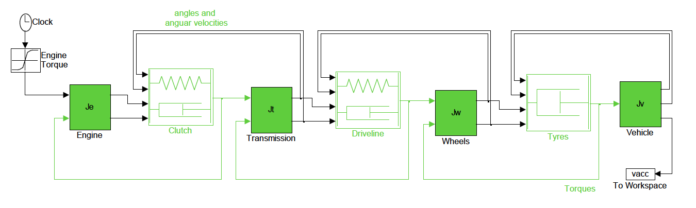

# Section 7: Drivetrain Dynamics
{: .no_toc }

<details close markdown="block">
  <summary>
    Table of contents
  </summary>
  {: .text-delta }
1. TOC
{:toc}
</details>

This part of the course deals with the longitudinal behaviour of the vehicle, how the engine torque is converted to longitudinal motion and how the torsion that is generated in the drivetrain components induces oscillatory dynamics which affect the way the driver relates to the vehicle i.e. driveability.

## Overview

Mechanical vibrations can be analysed in terms of INPUT, SYSTEM and OUTPUT;


*Figure 1: Vibration output caused by input excitation to the system*

In this case, all three play an important role (not just the SYSTEM).

The drivetrain system includes the engine, clutch, transmission, driveshafts, wheels, tyres and ultimately vehicle body. Engine mounts and suspension also have a (secondary) effect;


*Figure 2: Typical drivetrain subsystems*

### The Drivetrain as a Vibrating System

Mathematical models are usually based on a simplified representation. For the drivetrain, the various components can be represented as rotating masses and torsional springs. The drivetrain is then mounted to the vehicle body at various locations (especially engine mounts and vehicle suspension) providing structural paths for vibration transmission.


*Figure 3: Drivetrain visualised as a number of lumped masses connected by springs (compliant)*

Control can be achieved by isolating or reducing the vibration. This can be tackled by:

* Modifying the system dynamics (the MECHANICAL SYSTEM) for example by adding damping or shifting resonance frequencies
* Modifying the inputs (EXCITATIONS), to reduce their amplitude or shift their component frequencies.

### The Principal Degrees of Freedom

The simplest useful model of the drivetrain has three degrees of freedom;


*Figure 4: Simple 3 degree of freedom model of the drivetrain*

There is also a third mode; rigid-body rotation of the entire drivetrain. Each mode has its own natural frequency: typically 4 – 12 Hz for *shuffle* and 40 – 80 Hz for *rattle*.

| Mode |  |
|---|---|
| Shuffle | uneven acceleration of the vehicle, particularly after tip-in |
| Rattle | gearbox noise excited by engine torque fluctuations |
| Boom | interior noise: acoustic resonances of the passenger compartment, driven by structural vibrations |
| Judder | sometimes violent low frequency vibration of the vehicle occurring during clutch engagement |
| Clonk | noise and vibration associated with sudden take-up of lash freedom in the driveline |

## A Basic Torsion Model for the Driveline

### Driveline Model Schematic for a Front Wheel Drive Vehicle


*Figure 5: A front wheel drive vehicle drivetrain schematic*

### Representing a FWD Vehicle with a Four Mass Structure


*Figure 6: A more complex four degree of freedom representation of the drivetrain as springs, masses and dampers*

### Rotation or Translation?

Most of the inertia components in the drivetrain are rotational, so are described in terms of their moment of inertia, but the tyre translates rotation to translation in the vehicle body.  It’s easier to visualise the system as if it is translational but mathematically, the model is easier to formulate entirely as rotational. Consider the vehicle body and wheel components as separate free body diagrams;


*Figure 7:* Rotational or translation representation of the vehicle drivetrain?


*Figure 8:* Representation of the system as a rotational vs translational system.



*Figure 9:* Four mass representation of the drivetrain system

## Sources of Excitation

### Principal Excitation Sources

| Component | Source |
|---|---|
| Engine | combustion |
|        |irregular combustion |
|        |changes in throttle demand |
| Transmission | gear meshing |
|              | gear changes (in automatics) |
| Driveshafts  | angled universal joints |
| Tyres and wheels | runout |
|                  | mass unbalance |
|                  |tyre stiffness variations |

### Excitation from the Engine Combustion cycle

The total torque arising from all cylinders is oscillatory, with magnitude depending on where each cylinder is in the cycle.


*Figure 13:* Excitation caused by engine showing torque impulses from combustion

After sampling the four cylinder time history an FFT can be used to find its frequency content, shown below as order number which is the frequency normalised using the engine rotation frequency.  Each peak represents a frequency described in terms of the order i.e. frequency / rotational frequency.


*Figure 14:* Engine order excitation plot

Consider how each order of this combustion signal will change with engine speed, and when each order will coincide with one of the system’s resonance frequencies (fixed for each gear).


*Figure 15:* Campbell/interference diagram showing interaction of system response and excitation source

The first order response here just acts as a one to one mapping from engine speed units (RPM) to frequency (Hz). Eg 1000 revs per minute = 1000/60 = 16.67 revs (cycles) per second (Hz).  The diagram shows how the vibrational modes e.g. surge and rattle relate to the excitation generated over the engine speed range.  Where these intersect there will be resonance which may cause issues.

The vibration gets transmitted through the driveline when each order passes through the relevant (rattle) resonance frequency. Note that damping within the system spreads the effect across frequencies, with peak vibration transmission at the crossover point.

## A Closer look at Driveline Model Components

### The Clutch Springs / Torsion Damper


*Figure 16:* Torsion damper is the first means of isolating excitation from engine to driveline

The clutch isolation springs are the first defence against the transmission of vibration from the engine combustion cycle. They also provide damping, through friction with their housing. A combination of different rated springs is normally used.


*Figure 17:* Torsion damper is the first means of isolating excitation from engine to driveline


*Figure 18:* System response varies as a consequence of changes to torsional damper characteristics

### The Gearbox

A sequence of gears can be modelled as a single pair;


*Figure 19:* Transmission represented as two perfectly meshing gears

The torque is input on the left hand side, $T_a$ on the smaller gear labelled $a$.  The output torque, after the effect of the gearing, is $T_b$.  To calculate the output torque we first need to know the gear ratio, $G$;

$$ G = R/r $$

The torque acting at each $a$ and $b$ can be calculated using the following;

$$ T_a=Fr \nonumber $$

$$ T_b=FR \nonumber $$

and it is easy to see that to calculate the output torque, $T_b$ we just multiply the input torque, $T_a$ by the gear ratio;

$$ T_b=GT_a \nonumber  $$

Also, as velocity is the same at the point of contact i.e. where $a$ meshes with $b$;

$$ \dot{\theta}_a=G\dot{\theta}_b \nonumber $$

so that the following must be true;

$$ \ddot{\theta}_{a}=G \ddot{\theta}_{b}  \nonumber $$

$$ \theta_{a}=G \theta_{b}  \nonumber $$

#### A Simple Drivetrain Model

If we were to model the drivetrain as a simple three inertia system that includes the engine, $J_e$ transmission, $J_t$ and vehicle, $J_v$ $ we can represent it as shown in the diagram below;


*Figure 20:* A simple drivetrain model represented using three point inertias

In the diagram $T$ is the input torque, $T_1$ is the torque transmitted from the engine, $J_e$ to the input shaft of the transmission and $T_2$ is the torque transmitted from the output shaft of the transmission to the vehicle, $J_v$.  As can be seen from the diagram the transmission of the torque internally is by way of springs with stiffness $K_1$ and $K_2$ respectively.

Moving from left to right whilst referring to the above figure we can think about what is happening to the system.  The acceleration of the engine inertia, $J_e$, can be calculated;

$$ J_e \ddot{\theta}_e = T-T_1 \label{eq2} $$

The torque that arrives at the input shaft of the transmission, transmitted through the spring, is then, through the mechanical advantage that the gear ratio provides, scaled by the gear ratio, $G$. If we say that the point inertia of the transmission is located on the driven gear (we could put it before the torque scaling but the equations would be slightly different) then the acceleration of this point inertia, $J_t$) is calculated;

$$ J_t\ddot{\theta}_t=GT_1-T_2 \label{eq3}$$

The acceleration of the final inertia, $J_e$ is due to the torque that is transmitted through the second spring, with stiffness, $K_2$ and may be calculated;

$$ J_v\ddot{\theta}_v = T_2 \label{eq4} $$

The only other thing to consider is how to calculate the amount of torque transmitted through the two springs, $T_1$ and $T_2$ as labelled on the diagram. As we have seen on the spring-mass systems we looked at earlier in the course this is simple to calculate using Hooke's Law;

$$ T_1 = K_1(\theta_e-G\theta_t) \nonumber $$

$$ T_2 = K_2(\theta_t-\theta_v) \nonumber $$

The only thing to be aware of is the fact that we are now describing a rotational system so that the units of $K$ will be different, $Nm/rad$ instead of $N/m$ as with a translational system.

We can now put all of the above together to create the set of equations that fully describe the system by substituting for internal torques, $T_1$ and $T_2$ in Equations \ref{eq2}, \ref{eq3} and \ref{eq4};

$$ \begin{align}
J_{e} \ddot{\theta}_{e} &= T-K_{1}\left(\theta_{e}-G \theta_{t}\right) \label{eq5} \\
J_{t} \ddot{\theta}_{t} &= G K_{1}\left(\theta_{e}-G \theta_{t}\right)-K_{2}\left(\theta_{t}-\theta_{v}\right) \label{eq6} \\
J_{v} \ddot{\theta}_{v} &= K_{2}\left(\theta_{t}-\theta_{v}\right) \label{eq7} \end{align}   $$

This is a correct vibration model, but;

* It is messy, using $G$ in several places
* Different speeds, velocities and accelerations make vibration analysis less clear.

To address the second bullet point above define variables so they have matched steady-state values e.g. referencing all variables to the vehicle;

$$ \theta_{e}^{*} \equiv \frac{\theta_{e}}{G} \nonumber $$

so in rigid motion;

$$ \dot{\theta}_{e}^{*}=\dot{\theta}_{t}=\dot{\theta}_{v} \nonumber $$

Equations \ref{eq5} and \ref{eq6} then become;

$$ \begin{align}
J_{e} G \ddot{\theta}_{e}^{*} &= T-K_{1}\left(G \theta_{e}^{*}-G \theta_{t}\right) \label{eq8}\\
J_{t} \ddot{\theta}_{t} &= G K_{1}\left(G \theta_{e}^{*}-G \theta_{t}\right)-K_{2}\left(\theta_{t}-\theta_{v}\right) \label{eq9} \end{align} $$

Also if we define;

$$ \begin{align}
J_{e}^* & \equiv G^{2} J_{e} \label{eq10} \\
K_{1}^* & \equiv G^{2} K_{1} \label{eq11} \end{align} $$

and substituting Equations \ref{eq10} into Equations \ref{eq8};

$$ \frac{J_{e}^*}{G} \ddot{\theta}_{e}^* = T-\frac{K_{1}^*}{G}\left(\theta_{e}^{*}-\theta_{t}\right) \label{eq12} $$

then multiplying the resulting Equation \ref{eq12} by $G$;

$$ J_{e}^{*} \ddot{\theta}_{e}^{*} = G T-K_{1}^{*}\left(\theta_{e}^{*}-\theta_{t}\right) \label{eq13} $$

and substituting Equation \ref{eq11} into Equation \ref{eq9};

$$ J_{t} \ddot{\theta}_{t} = K_{1}\left(\theta_{e}^{*} - \theta_{t}\right) - K_{2}\left(\theta_{t}-\theta_{v} \right) \label{eq14} $$

so that the system may be described using Equations \ref{eq13}, \ref{eq14} and \ref{eq7};

$$ \begin{align}
J_{e}^{*} \ddot{\theta}_{e}^{*} &= G T-K_{1}^{*}\left(\theta_{e}^{*}-\theta_{t}\right) \nonumber \\
J_{t} \ddot{\theta}_{t} &= K_{1}\left(\theta_{e}^{*}-\theta_{t}\right)-K_{2}\left(\theta_{t}-\theta_{v}\right) \nonumber \\
J_{v} \ddot{\theta}_{v} &= K_{2}\left(\theta_{t}-\theta_{v}\right) \nonumber \end{align} $$

These are general mass / spring equations, with all parameters upstream of the gearbox defined in terms of the gear ratio (damping constants would also be multiplied by $G^2$). Clearly, the vibration dynamics will change significantly with gear.

You can see the response for different gears measured from one of the department’s test vehicles. Although there’s a fair amount of noise (which you should expect from accelerometers) note how shuffle appears, as a clear second order response.


*Figure 21: Measurement data of driveline torsional vibration*

### The Effect of Including Lash Nonlinearities

Lash, or free play in the driveline, allows upstream components to accelerate without resistance for a fraction of a second, before reconnecting, and passing on the acquired energy in the form of an impulse. Lash can occur in several places within the driveline, but is modelled only within the axle component in our model, for simplicity.


*Figure 22: Representation of lash in a driveline*


*Figure 23: Driveline lash response as the vehicle accelerates*


*Figure 24: Magnified view of the driveline response showing lash*

It is possible to include lash in driveline models built in Simulink by using a las block.

### An Appropriate Model for the Tyre

Longitudinal tyre force (in acceleration) is generated as a function of rubber compressing as it enters the tyre contact patch and extending as it leaves. The compression is modelled by a relative speed difference between the contact patch and the road, given by;


*Figure 26: Tyre slip vs tractive force*

The percentage slip is calculated;

$$ \text{slip} = \frac{r\omega}{v}-1 \nonumber $$

where $r$ is the radius of the tyre, $\omega$ the wheel angular velocity and $v$ the vehicle velocity.

## Free and forced vibration analysis

#### Linear System Analysis

Some of the advantages and disadvantages of linear system analysis;

* Pros
  * Lots of analysis options
  * Eigenvectors/values
  * Frequency response
  * Simulation studies
  * East to apply control theory
* Cons
  * Less realistic

#### Nonlinear System Analysis

Some of the advantages and disadvantages of nonlinear system analysis;

* Pros
  * More realistic
* Cons
  * Can only do simulation studies

### Eigenvector / value (mode) analysis of Linear Systems

The following is largely a repeat of some material we saw earlier, in Section 4. It is included here as a reminder, and we quickly get on, from general cases to analysing the driveline case.

#### Derivation of a state-space form


*Figure 27:*

Start with second-order differential equations;

$$F-l(\theta_2-\theta_1)=l\ddot{\theta}_2 \nonumber $$

$$l(\theta_2-\theta_1)-l\theta_1-l\dot{\theta}_1=l\ddot{\theta}_1 \nonumber $$

Define a set of state variables, to reduce this second order system to a vector / matrix form using only first order equations;

$$\dot{\mathbf{x}}=A\mathbf{x}+B\mathbf{u}$$

$$\mathbf{y}=C\mathbf{x}+D\mathbf{u} \nonumber $$

Second order equations in displacement can be reduced to first order by defining velocity states;

$$ \begin{aligned}
&x_{1}=\theta_{1} \\
&x_{2}=\theta_{2} \\
&x_{3}=\dot{\theta}_{1} \\
&x_{4}=\dot{\theta}_{2}
\end{aligned} \nonumber $$

$$ \begin{aligned}
&\dot{x}_{1}=x_{3} \\
&\dot{x}_{2}=x_{4} \\
&\dot{x}_{3}=x_{2}-2 x_{1}-x_{3} \\
&\dot{x}_{4}=F-x_{2}+x_{1}
\end{aligned} \nonumber $$

Filling in the matrices, $A$ and $C$;

$$ \left[\begin{array}{l}
\dot{x}_{1} \\
\dot{x}_{2} \\
\dot{x}_{3} \\
\dot{x}_{4}
\end{array}\right]=\left[\begin{array}{lrrr}
0 & 0 & 1 & 0 \\
0 & 0 & 0 & 1 \\
-2 & 1 & -1 & 0 \\
1 & -1 & 0 & 0
\end{array}\right]\left[\begin{array}{l}
x_{1} \\
x_{2} \\
x_{3} \\
x_{4}
\end{array}\right]+\left[\begin{array}{l}
0 \\
0 \\
0 \\
1
\end{array}\right] \mathbf{F} \nonumber $$

Matrix $A$ has very useful properties;

The free vibration of the masses (F=0) can be described by a summation of modal components having a predictable form;

#### Model Vibrations

The free vibration of the masses (F=0) can be described by a summation of modal components having a predictable form;

$$ \mathbf{\theta}(t)=\operatorname{Re}\left\{\underline{u}_{1} e^{\lambda_{1} t}+\underline{u}_{2} e^{\lambda_{2} t}+\ldots+\underline{u}_{n} e^{\lambda_{n} t}\right\}  \nonumber $$

Where $\mathbf{\theta}(t)$ is the $2\times1$ displacement vector, and $\lambda_k$ is a complex constant is a complex scalar.  Within each ‘modal component’;

$$ \mathbf{\theta}(t)=\mathbf{u}_{1} e^{\lambda_{1}t}  \nonumber $$

so;

$$ \mathbf{\dot{\theta}}(t)=\lambda_{1} \mathbf{u}_{1} e^{\lambda_{1} t}  \nonumber $$

therefore;

$$ \underline{x}(t)=\underline{v}_{1} e^{\lambda_{1} t} \nonumber $$

where;

$$ \underline{v}_{1}=\left[\begin{array}{c}
\underline{u}_{1} \\
\lambda_{1} \underline{u}_{1}
\end{array}\right] \nonumber $$

Now, if F=0, from Eqn 1;

$$ \lambda_{1} \underline{v}_{1} e^{\lambda_{1} t}=A \underline{v}_{1} e^{\lambda_{1} t} \nonumber $$

therefore;

$$ \lambda_{1} \underline{v}_{1}=A \underline{v}_{1} \nonumber $$

so $\lambda_1$ is an eigenvalue of $A$ and $\nu_1$ is the corresponding *eigenvector*.
For the spring / mass example above, the four eigenvalues are;

$$ \begin{aligned}
&\lambda_{1}=-0.35+1.5 \mathrm{j} \\
&\lambda_{2}=-0.35-1.5 \mathrm{j} \\
&\lambda_{3}=-0.15+0.63 \mathrm{j} \\
&\lambda_{4}=-0.15-0.63 \mathrm{j}
\end{aligned} \nonumber $$

Note that the eigenvalues come in pairs, with each pair describing a mode of vibration. The eigenvalues equate to the system poles, and pole pairs can be written generally as;

$$ \lambda_{1 \& 2}=\sigma \pm j \omega $$

where $\sigma$ is the modal damping factor, and $\omega$ is the damped natural frequency of the mode. To see what each single term in $\underline{\theta}(t)=\operatorname{Re}\left\{\underline{u}_{1} e^{\lambda_{1} t}+\underline{u}_{2} e^{\lambda_{2} t}+\ldots+\underline{u}_{n} e^{\lambda_{n} t}\right\} $ looks like, re-substitute $\lambda$ and use Euler’s formula for the complex exponent;

$$ \underline{u}_{1} e^{\lambda_{1} t}=\underline{u}_{1} e^{(\sigma+\omega i) t}=\underline{u}_{1} e^{\sigma t} e^{i \omega t}=\underline{u}_{1} e^{\sigma t}(\cos (\omega t)+i \sin (\omega t)) $$

$\sigma$ should be negative if your model is correct, and it relates to a physical system, because this determines the envelope of the response, as a decaying exponential (shown below in dashed lines). ω then gives the frequency of the sinusoid component (dotted lines), (cos ωt + isin ωt) and the solid line shows the combination of the two.


*Figure 28:*

This is then multiplied by the complex constants, $u_i$, which affect the magnitude of the response (in this case the magnitude of $\theta_1$ compared with $\theta_2$) and the relative phase (eg 90° phase difference would have the $\theta_1$ at 0 at the same time as $\theta_2$ is at its peak).

#### Eigenstructure of the four mass Driveline model:

The order of the states is important when it comes to interpreting eigenvectors. Here we choose the (rotational) deflections first, followed by the velocities;


*Figure 29:*

NB : To achieve this ordering of states for your Simulink model, assign outports (at the top level of the model) to each of the required states, in the order shown above. Because the outputs correlate with the states, when you carry out further analysis (eg via linmod) on the model, Simulink will choose the states in the same order as the outputs. (Without outputs, the states are chosen in an arbitrary order, depending on when the integrators were ‘dropped’ into the Simulink model.) You can check that you’ve got an exact match of states = outputs by checking the C matrix you get from linmod (which should be the identity matrix).

When the model is set up correctly, it is very easy to extract the Eigenstructure in Matlab;

```matlab
[A,B,C,D] = linmod(‘drive4’);
[V,D] = eig(A);
```

#### Eigenvalues (shaded), and their associated Eigenvectors (tabled).

Note how each row of the Eigenvector matrix relates to a state, and each column relates to an Eigenvalue.


*Figure 30:*

Dividing by the largest element within an appropriate set of four eigenvectors, we can derive the relative motion between masses, in the rattle mode;


*Figure 31:*

and the shuffle mode;


*Figure 32:*

It is easier to visualise this if you plot the eigenvector components as real vs imag ‘phasors’ arranged like the masses in the model;

#### Mode 1 - shuffle


*Figure 33:*

#### Mode 2 - rattle


*Figure 34:*

### Frequency Response

For the Eigenstructure analysis we assigned outports to each of the states. Now look at the frequency response (Bode plot) between the engine torque input, and the vehicle acceleration, and transmission (gearbox) acceleration outputs. (Assign inports and outports at the top level of the model, appropriately.). Then;

```matlab
[A,B,C,D] = linmod(‘drive4’);
sys = ss(A,B,C,D);
f = [0.1:0.1:1000]';
[mag,phase] = bode(sys,f*2*pi);
mag = squeeze(mag)';
loglog(f,mag);
grid on;
```


*Figure 35:*