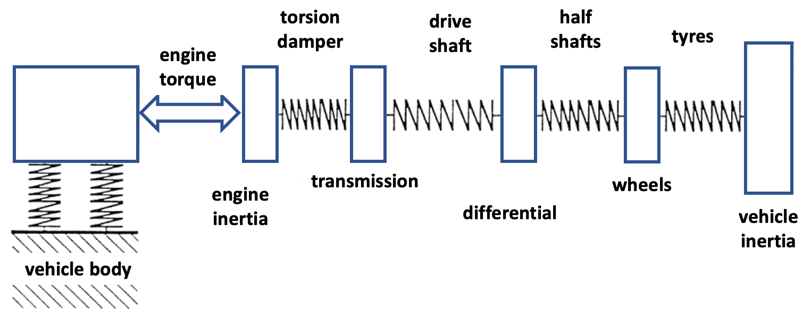
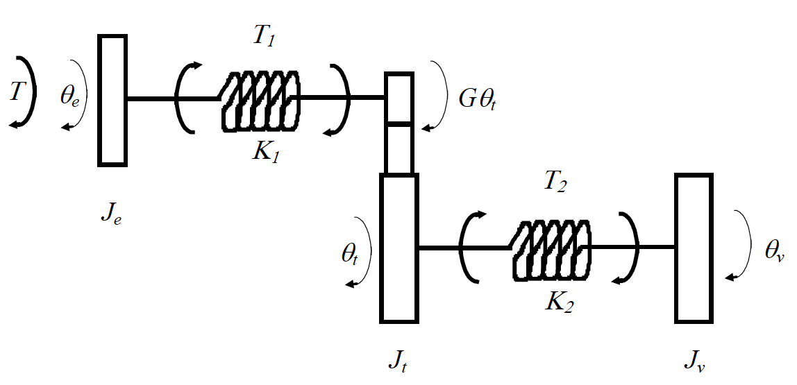

# Section 7: Drivetrain Dynamics
{: .no_toc }

<details close markdown="block">
  <summary>
    Table of contents
  </summary>
  {: .text-delta }
1. TOC
{:toc}
</details>

This part of the course deals with the longitudinal behaviour of the vehicle, how the engine torque is converted to longitudinal motion and how the torsion that is generated in the drivetrain components induces oscillatory dynamics which affect the way the driver relates to the vehicle i.e. driveability.

## Overview

Mechanical vibrations can be analysed in terms of INPUT, SYSTEM and OUTPUT:


*Figure 1: Vibration output caused by input excitation to the system*

In this case, all three play an important role (not just the SYSTEM).

The drivetrain system includes the engine, clutch, transmission, driveshafts, wheels, tyres and ultimately vehicle body. Engine mounts and suspension also have a (secondary) effect;


*Figure 2: Typical drivetrain subsystems*

### The Drivetrain as a Vibrating System

Mathematical models are usually based on simplified engineering concepts. For the
drivetrain, the various components can be represented as rotating masses and torsional
springs. The drivetrain is then mounted to the vehicle body at various locations (especially engine mounts and vehicle suspension) providing structural paths for vibration transmission.


*Figure 3: Drivetrain visualised as a number of lumped masses connected by springs (compliant)*

Control can be achieved by isolating or reducing the vibration. This can be tackled by:

* Modifying the system dynamics (the MECHANICAL SYSTEM) – eg by adding damping or shifting resonance frequencies
* Modifying the inputs (EXCITATIONS), to reduce their amplitude or shift their component frequencies.

### The Principal Degrees of Freedom

The simplest useful model of the drivetrain has three degrees of freedom;


*Figure 4: Simple 3 degree of freedom model of the drivetrain*

There is also a third mode; rigid-body rotation of the entire drivetrain. Each mode has its own natural frequency: typically 2 – 5 Hz for \emph{shuffle} and 40 – 80 Hz for \emph{rattle}.

| Mode |  |
|---|---|
| shuffle | uneven acceleration of the vehicle, particularly after ‘tip-in’ |
| rattle | gearbox noise excited by engine torque fluctuations |
| boom | interior noise: acoustic resonances of the passenger compartment, driven by structural vibrations |
| judder | sometimes violent low frequency vibration of the vehicle occurring during clutch engagement |
| clunk | noise and vibration associated with sudden take-up of lash freedom in the driveline |

## A Basic Torsion Model for the Driveline

### Driveline Model Schematic for a Front Wheel Drive Vehicle


*Figure 5: A front wheel drive vehicle drivetrain schematic*

### Representing a FWD Vehicle with a Four Mass Structure


*Figure 6: A more complex four degree of freedom representation of the drivetrain as springs, masses and dampers*

### Rotation or Translation?

Most of the inertia components in the drivetrain are rotational, so are described in terms of their moment of inertia, but the tyre translates rotation to translation in the vehicle body;


*Figure 7:*

### Equivalent Rotating Vehicle Intertia

It’s easier to visualise the system as if it is translational (four mass structure above), but mathematically, the model is easier to formulate entirely as rotational (we’ll see this for the tyre, later). Consider the vehicle body and wheel components as separate free body diagrams:


*Figure 9:*


*Figure 10:*

### Four Mass Model in Simulink


*Figure 11:*

### Standard Model Components

Spring Damper component (calculates ‘forces’ to apply to masses, from relative motions)


*Figure 12:*

‘Mass’ component (calculates motion on a single mass, from ‘forces’ (torques) applied)


*Figure 13:*

### Basic (linear) Simulation Response


*Figure 14:*

## Sources of Excitation

### Principal Excitation Sources

| Component | Source |
|---|---|
| Engine | combustion |
|        |irregular combustion |
|        |changes in throttle demand |
| Transmission | gear meshing |
|              | gear changes (in automatics) |
| Driveshafts  | angled universal joints |
| Tyres and wheels | runout |
|                  | mass unbalance |
|                  |tyre stiffness variations |

### Excitation from the Engine Combustion cycle

The total torque arising from all cylinders is oscillatory, with magnitude depending on where each cylinder is in the suck / push / bang / blow cycle.


*Figure 15:*

After sampling the four cylinder ‘time history’ an FFT is used to find its frequency content, shown below as ‘order number’ (ie normalised against the engine rotation frequency).


*Figure 16:*


*Figure 17:*

Consider how each order of this combustion signal will change with engine speed, and when each order will coincide with one of the system’s resonance frequencies (fixed for each gear).


*Figure 18:*

NB: The 1st order response here just acts as a 1:1 mapping from engine speed units (RPM) to frequency (Hz). Eg 1000 revs per minute = 1000/60 = 16.67 revs (cycles) per second (Hz).

The vibration gets transmitted through the driveline when each order passes through the relevant (rattle) resonance frequency. Note that damping within the system ‘spreads’ the effect across frequencies, with peak vibration transmission at the ‘crossover’ point.


*Figure 19:*

## A Closer look at Driveline Model Components

### The clutch springs (torsion damper)

The clutch isolation springs are the first defence against the transmission of vibration from the engine combustion cycle. They also provide damping, through friction with their housing. A combination of different rated springs is used;


*Figure 20:*


*Figure 21:*

### The Gearbox

A sequence of gears can be modelled as a single pair;


*Figure 22:*

$ T_a= $ the torque input to $a$

$ T_b= $ the torque output from $b$

$$ G = R/r \nonumber $$

$$ T_a=Fr, T_b=FR \nonumber $$

so;

$$ T_b=GT_a \nonumber  $$

Also, as velocity is constant at contact;

$$ \dot{\theta}_a=G\dot{\theta}_b \nonumber $$

and;

$$
\begin{aligned}
&\ddot{\theta}_{a}=G \ddot{\theta}_{b} \\
&\theta_{a}=G \theta_{b}
\end{aligned} \nonumber $$

In a simple drivetrain model;


*Figure 23:*

Substituting for internal torques, $T_1$ and $T_2$;

$$
\begin{aligned}
&T-K_{1}\left(\theta_{e}-G \theta_{t}\right)=J_{e} \ddot{\theta}_{e} \\
&G K_{1}\left(\theta_{e}-G \theta_{t}\right)-K_{2}\left(\theta_{t}-\theta_{v}\right)=J_{t} \ddot{\theta}_{t} \\
&K_{2}\left(\theta_{t}-\theta_{v}\right)=J_{v} \ddot{\theta}_{v}
\end{aligned} \nonumber 
$$

This is a correct vibration model, but;

* It's messy, using $G$ factors in several places
* Different speeds, velocities and accelerations make vibration analysis less clear.

To address (ii) define variables so they have matched steady-state values e.g. referencing all variables to the vehicle;

$$
\theta_{e}^{*} \equiv \theta_{e} / G \nonumber 
$$

so in rigid motion;

$$
\dot{\theta}_{e}^{*}=\dot{\theta}_{t}=\dot{\theta}_{v} \nonumber 
$$

First two equations (1) are then;

$$
\begin{aligned}
&T-K_{1}\left(G \theta_{e}^{*}-G \theta_{t}\right)=J_{e} G \ddot{\theta}_{e}^{*} \\
&G K_{1}\left(G \theta_{e}^{*}-G \theta_{t}\right)-K_{2}\left(\theta_{t}-\theta_{v}\right)=J_{t} \ddot{\theta}_{t}
\end{aligned} \nonumber
$$

Even more messy, but not if we also define;

$$
\begin{aligned}
J_{e}^{*} & \equiv G^{2} J_{e} \\
K_{1}^{*} & \equiv G^{2} K_{1}
\end{aligned} \nonumber
$$

The first equation multiplied by $G$ is now;

$$
G T-K_{1}^{*}\left(\theta_{e}^{*}-\theta_{t}\right)=J_{e}^{*} \ddot{\theta}_{e}^{*} \nonumber
$$

and

$$
K_{1}^{*}\left(\theta_{e}^{*}-\theta_{t}\right)-K_{2}\left(\theta_{t}-\theta_{v}\right)=J_{t} \ddot{\theta}_{t} \nonumber
$$

with

$$
K_{2}\left(\theta_{t}-\theta_{v}\right)=J_{v} \ddot{\theta}_{v} \nonumber 
$$

These are general mass / spring equations, with all parameters ‘upstream’ of the gearbox defined in terms of the gear ratio (damping constants would also be multiplied by G2). Clearly, the vibration dynamics will change significantly with gear.

You can see the effect, in terms of altered frequency, and damping rate in these responses, measured from one of the department’s old test vehicles. Although there’s a fair amount of noise (which you should expect from accelerometers), note how shuffle appears, as a clear second order response.


*Figure 24:*

### The effect of including lash nonlinearities

Lash, or free play in the driveline, allows ‘upstream’ components to accelerate without resistance for a fraction of a second, before reconnecting, and passing on the acquired energy in the form of an impulse. Lash can occur in several places within the driveline, but is modelled only within the axle component in our model, for simplicity.


*Figure 25:*


*Figure 26:*


*Figure 27:*

Lash is included in the model using a lash block;


*Figure 28:*

### An appropriate model for the tyre;

Longitudinal tyre force (in acceleration) is generated as a function of rubber compressing as it enters the tyre contact patch, and extending as it leaves. The compression is modelled by a relative speed difference between the contact patch and the road, given by;


*Figure 29:*

## Free and forced vibration analysis

#### Linear System Analysis

Some of the advantages and disadvantages of linear system analysis;

* Pros
  * Lots of analysis options
  * Eigenvectors/values
  * Frequency response
  * Simulation studies
  * East to apply control theory
* Cons
  * Less realistic

#### Nonlinear System Analysis

Some of the advantages and disadvantages of nonlinear system analysis;

* Pros
  * More realistic
* Cons
  * Can only do simulation studies

### Eigenvector / value (mode) analysis of Linear Systems

The following is largely a repeat of some material we saw earlier, in Section 4. It is included here as a reminder, and we quickly get on, from general cases to analysing the driveline case.

#### Derivation of a state-space form


*Figure 30:*

Start with second-order differential equations;

$$F-l(\theta_2-\theta_1)=l\ddot{\theta}_2 \nonumber $$

$$l(\theta_2-\theta_1)-l\theta_1-l\dot{\theta}_1=l\ddot{\theta}_1 \nonumber $$

Define a set of ‘state’ variables, to reduce this second order system to a vector / matrix form using only first order equations;

$$\dot{\bm{x}}=A\bm{x}+B\bm{u}$$
$$\bm{y}=C\bm{x}+D\bm{u} \nonumber $$

Second order equations in displacement can be reduced to first order by defining velocity states;

$$
\begin{aligned}
&x_{1}=\theta_{1} \\
&x_{2}=\theta_{2} \\
&x_{3}=\dot{\theta}_{1} \\
&x_{4}=\dot{\theta}_{2}
\end{aligned} \nonumber 
$$

$$
\begin{aligned}
&\dot{x}_{1}=x_{3} \\
&\dot{x}_{2}=x_{4} \\
&\dot{x}_{3}=x_{2}-2 x_{1}-x_{3} \\
&\dot{x}_{4}=F-x_{2}+x_{1}
\end{aligned} \nonumber 
$$

Filling in the matrices, $A$ and $C$;

$$
\left[\begin{array}{l}
\dot{x}_{1} \\
\dot{x}_{2} \\
\dot{x}_{3} \\
\dot{x}_{4}
\end{array}\right]=\left[\begin{array}{lrrr}
0 & 0 & 1 & 0 \\
0 & 0 & 0 & 1 \\
-2 & 1 & -1 & 0 \\
1 & -1 & 0 & 0
\end{array}\right]\left[\begin{array}{l}
x_{1} \\
x_{2} \\
x_{3} \\
x_{4}
\end{array}\right]+\left[\begin{array}{l}
0 \\
0 \\
0 \\
1
\end{array}\right] \mathrm{F} \nonumber 
$$

Matrix $A$ has very useful properties;

The free vibration of the masses (F=0) can be described by a summation of modal components having a predictable form;

#### Model Vibrations

The free vibration of the masses (F=0) can be described by a summation of modal components having a predictable form;

$$ \bm{\theta}(t)=\operatorname{Re}\left\{\underline{u}_{1} e^{\lambda_{1} t}+\underline{u}_{2} e^{\lambda_{2} t}+\ldots+\underline{u}_{n} e^{\lambda_{n} t}\right\}  \nonumber $$

Where $\bm{\theta}(t)$ is the $2\times1$ displacement vector, and $\lambda_k$ is a complex constant is a complex scalar.  Within each ‘modal component’;

$$ \bm{\theta}(t)=\bm{u}_{1} e^{\lambda_{1}t}  \nonumber $$

so;

$$ \bm{\dot{\theta}}(t)=\lambda_{1} \bm{u}_{1} e^{\lambda_{1} t}  \nonumber $$

therefore;

$$
\underline{x}(t)=\underline{v}_{1} e^{\lambda_{1} t} \nonumber 
$$

where;

$$
\underline{v}_{1}=\left[\begin{array}{c}
\underline{u}_{1} \\
\lambda_{1} \underline{u}_{1}
\end{array}\right] \nonumber 
$$

Now, if F=0, from Eqn 1;

$$
\lambda_{1} \underline{v}_{1} e^{\lambda_{1} t}=A \underline{v}_{1} e^{\lambda_{1} t} \nonumber 
$$

therefore;

$$
\lambda_{1} \underline{v}_{1}=A \underline{v}_{1} \nonumber 
$$

so $\lambda_1$ is an eigenvalue of $A$ and $\nu_1$ is the corresponding *eigenvector*.
For the spring / mass example above, the four eigenvalues are;

$$
\begin{aligned}
&\lambda_{1}=-0.35+1.5 \mathrm{j} \\
&\lambda_{2}=-0.35-1.5 \mathrm{j} \\
&\lambda_{3}=-0.15+0.63 \mathrm{j} \\
&\lambda_{4}=-0.15-0.63 \mathrm{j}
\end{aligned} \nonumber 
$$

Note that the eigenvalues come in pairs, with each pair describing a mode of vibration. The eigenvalues equate to the system poles, and pole pairs can be written generally as;

$$
\lambda_{1 \& 2}=\sigma \pm j \omega
$$

where $\sigma$ is the modal damping factor, and $\omega$ is the damped natural frequency of the mode. To see what each single term in $\underline{\theta}(t)=\operatorname{Re}\left\{\underline{u}_{1} e^{\lambda_{1} t}+\underline{u}_{2} e^{\lambda_{2} t}+\ldots+\underline{u}_{n} e^{\lambda_{n} t}\right\} $ looks like, re-substitute $\lambda$ and use Euler’s formula for the complex exponent;

$$
\underline{u}_{1} e^{\lambda_{1} t}=\underline{u}_{1} e^{(\sigma+\omega i) t}=\underline{u}_{1} e^{\sigma t} e^{i \omega t}=\underline{u}_{1} e^{\sigma t}(\cos (\omega t)+i \sin (\omega t))
$$

$\sigma$ should be negative if your model is correct, and it relates to a physical system, because this determines the ‘envelope’ of the response, as a decaying exponential (shown below in dashed lines). ω then gives the frequency of the sinusoid component (dotted lines), (cos ωt + isin ωt) and the solid line shows the combination of the two.


*Figure 31:*

This is then multiplied by the complex constants, $u_i$, which affect the magnitude of the response (in this case the magnitude of $\theta_1$ compared with $\theta_2$) and the relative phase (eg 90° phase difference would have the $\theta_1$ at 0 at the same time as $\theta_2$ is at its peak).

#### Eigenstructure of the four mass Driveline model:

The order of the states is important when it comes to interpreting eigenvectors. Here we choose the (rotational) deflections first, followed by the velocities;


*Figure 32:*

NB : To achieve this ordering of states for your Simulink model, assign outports (at the top level of the model) to each of the required states, in the order shown above. Because the outputs correlate with the states, when you carry out further analysis (eg via linmod) on the model, Simulink will choose the states in the same order as the outputs. (Without outputs, the states are chosen in an arbitrary order, depending on when the integrators were ‘dropped’ into the Simulink model.) You can check that you’ve got an exact match of states = outputs by checking the C matrix you get from linmod (which should be the identity matrix).

When the model is set up correctly, it is very easy to extract the Eigenstructure in Matlab;

```matlab
[A,B,C,D] = linmod(‘drive4’);
[V,D] = eig(A);
```

#### Eigenvalues (shaded), and their associated Eigenvectors (tabled).

Note how each row of the Eigenvector matrix relates to a state, and each column relates to an Eigenvalue.


*Figure 33:*

Dividing by the largest element within an appropriate set of four eigenvectors, we can derive the relative motion between masses, in the rattle mode;


*Figure 34:*

and the shuffle mode;


*Figure 35:*

It is easier to visualise this if you plot the eigenvector components as real vs imag ‘phasors’ arranged like the masses in the model;

#### Mode 1 - shuffle


*Figure 36:*

#### Mode 2 - rattle


*Figure 37:*

### Frequency Response

For the Eigenstructure analysis we assigned outports to each of the states. Now look at the frequency response (Bode plot) between the engine torque input, and the vehicle acceleration, and transmission (gearbox) acceleration outputs. (Assign inports and outports at the top level of the model, appropriately.). Then;

```matlab
[A,B,C,D] = linmod(‘drive4’);
sys = ss(A,B,C,D);
f = [0.1:0.1:1000]';
[mag,phase] = bode(sys,f*2*pi);
mag = squeeze(mag)';
loglog(f,mag);
grid on;
```


*Figure 38:*